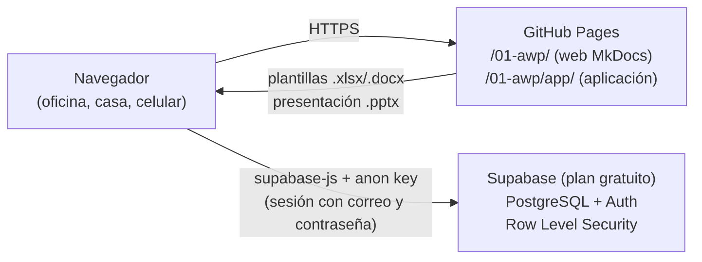
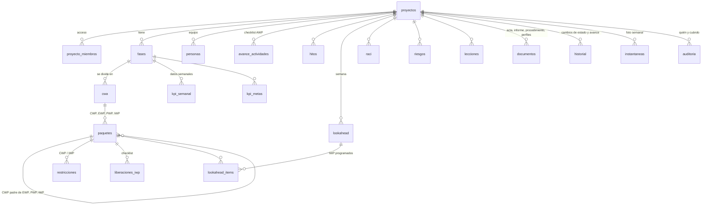
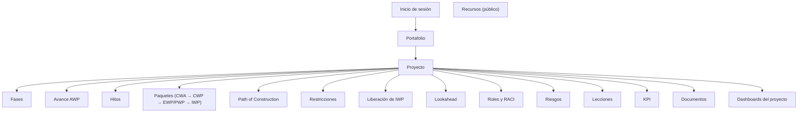

# Aplicación AWP – Documento de diseño (Etapa 1)

Aplicación web para registrar y seguir la implementación de AWP en varios proyectos de construcción a la vez. Usa los mismos conceptos, códigos, fases, etapas, roles, estados y KPI del **kit de implementación** (`docs/implementacion/`, `implementacion/plantillas/`) y de la **presentación de 122 láminas** (`presentacion/implementacion_awp.pptx`).

> **Estado:** Etapa 1 (diseño). Incluye este documento, la maqueta navegable (`app/maqueta/index.html`) y el script de base de datos (`app/supabase/esquema.sql`). La construcción empieza en la Etapa 2, cuando se apruebe la maqueta y Supabase esté listo.

## Índice

1. [Decisiones de arquitectura](#1-decisiones-de-arquitectura)
2. [Revisión de las plantillas del kit](#2-revision-de-las-plantillas-del-kit)
3. [Plantilla → módulo → formulario](#3-plantilla-modulo-formulario)
4. [Modelo de datos](#4-modelo-de-datos)
5. [Seguridad](#5-seguridad)
6. [Catálogo de dashboards](#6-catalogo-de-dashboards)
7. [Pantallas y navegación](#7-pantallas-y-navegacion)
8. [Experiencia didáctica](#8-experiencia-didactica)
9. [Biblioteca de recursos](#9-biblioteca-de-recursos)
10. [Importar y exportar](#10-importar-y-exportar)
11. [Estilo visual](#11-estilo-visual)
12. [Plan de construcción por etapas](#12-plan-de-construccion-por-etapas)
13. [Pendientes y supuestos](#13-pendientes-y-supuestos)

---

## 1. Decisiones de arquitectura



| Tema | Decisión | Motivo |
|---|---|---|
| Publicación | La aplicación vive en `app/web/` y se publica en **`/01-awp/app/`** con el mismo workflow de GitHub Pages. El hook `hooks/aplicacion.py` copia `app/web/` y la maqueta `app/maqueta/` al sitio (la maqueta ya está en **`/01-awp/app/maqueta/`**, enlazada desde el menú de la web). | No se toca la publicación de MkDocs; `mkdocs build --strict` sigue siendo la única compilación. |
| Compilación | **Sin compilación**: HTML + módulos JavaScript (ES modules) + Preact con `htm` (componentes sin JSX ni Node). | Nada que instalar; se puede editar desde GitHub; el workflow actual no cambia. |
| Librerías | Copias locales en `app/web/vendor/` (no CDN): `supabase-js` (datos y sesión), **Preact + htm** (interfaz), **Apache ECharts** (gráficos, exportación a imagen, táctil), **ExcelJS** (leer y escribir las plantillas Excel), **docx** (generar Word), **jsPDF + html2canvas** (PDF e imágenes), **Driver.js** (recorrido guiado), íconos **Lucide**. Todas con licencia MIT, Apache 2.0 o ISC. | La web ya aloja Mermaid localmente por la misma razón: funciona aunque una red corporativa bloquee los CDN. |
| Datos | **Supabase** (PostgreSQL + Auth). Inicio de sesión con correo y contraseña. | Plan gratuito suficiente (500 MB de base de datos). |
| Configuración | `app/web/config.js` con la **URL del proyecto** y la **anon key**. Ambas son públicas por diseño: la seguridad la da el RLS. **Nunca** se usa la *service_role key*. | Requisito de seguridad. |
| Rutas | Enrutamiento con `#` (`/app/#/proyecto/…`). | GitHub Pages sirve archivos estáticos; no necesita reglas de servidor. |
| Celular | Diseño adaptable (móvil primero en formularios); manifiesto web para instalarla como app en el celular. | Uso en obra y de viaje. |
| Borradores | Guardado automático en el navegador cada pocos segundos y, con sesión, en la tabla `borradores` para continuar desde otro dispositivo. | Oficina, casa y celular. |
| Fórmulas | Los campos calculados de las plantillas se calculan en **vistas SQL** (`v_restricciones`, `v_paquetes`, `v_iwp_liberacion`, `v_riesgos`, `v_lecciones`, `v_raci`, `v_avance_etapas`) con las mismas fórmulas que el Excel. | Un solo cálculo para formularios, tablas, dashboards y exportación. |
| Fecha de corte | Los atrasos se calculan con la fecha de hoy o con la **fecha de corte** del proyecto (el proyecto de ejemplo usa 15/06/2028, como las plantillas). | Coherencia con las filas de ejemplo del kit. |

### Estructura de carpetas

```text
app/
├── DISENO.md                ← este documento
├── maqueta/index.html       ← maqueta navegable (Etapa 1)
├── supabase/
│   ├── estructura.sql       ← tablas, triggers, vistas, RLS (se edita aquí)
│   ├── generar_esquema.py   ← une estructura + catálogos del kit
│   ├── esquema.sql          ← script final para pegar en Supabase (generado)
│   ├── GUIA_SUPABASE.md     ← paso a paso para crear el proyecto
│   └── pruebas/             ← pruebas de RLS con PostgreSQL local
└── web/                     ← la aplicación (desde la Etapa 2)
    ├── index.html, app.js, config.js, estilos.css, manifest.webmanifest
    ├── modulos/             ← un archivo por módulo
    ├── componentes/         ← formulario por pasos, tabla con filtros, gráficos…
    ├── datos/recursos.json  ← catálogo de la biblioteca (público)
    ├── datos/ejemplo.js     ← proyecto de ejemplo (datos públicos del kit)
    └── vendor/              ← librerías locales
```

---

## 2. Revisión de las plantillas del kit

Se revisaron las **18 plantillas** de `implementacion/plantillas/` (11 Excel y 7 Word), más el plan (`Plan_Implementacion_AWP.docx`) y la presentación.

### 2.1 Plantillas Excel

Todas comparten: hoja **Instrucciones**, hoja **Listas** (rangos con nombre), columna **Ejemplo**, fecha de corte en B3, encabezado en la fila 5 y datos desde la fila 6.

| Plantilla | Hojas de datos | Columnas que se ingresan | Listas de valores | Campos calculados |
|---|---|---|---|---|
| **Registro_Restricciones** | Registro, Resumen | ID, fase, CWP, IWP, tipo, descripción, responsable (rol), nombre, fechas identificada / requerida / liberación, estado, observaciones | Fases, TiposRestriccion (12), EstadosRestriccion (Abierta, En gestión, Liberada, Cancelada), Roles (16) | Días de atraso; situación (Vencida, Por vencer ≤ 7 días, En plazo, Liberada a tiempo / con atraso, Cancelada); resumen por fase y por tipo |
| **Matriz_Roles_RACI** | Matriz RACI, Roles, Resumen por rol | N.°, etapa, actividad, fase, una columna por rol (CLI … SUB) | Etapas (5), FasesExt, R/A/C/I | N.° de A, N.° de R, verificación («una sola A»); participación por rol |
| **Seguimiento_Paquetes** | Paquetes, Restricciones, Resumen por fase | Código, tipo, fase, descripción, disciplina, CWA, CWP asociado, sistema, responsable, estado, inicio/fin plan y real, % avance, HH, observaciones | TiposPaquete (CWA…IWP), Fases, Disciplinas (8), EstadosPaquete (8), Roles | Restricciones abiertas; días de atraso; situación (En plazo, Inicio atrasado, Atrasado, Cerrado, Cerrado con atraso); resumen por fase y tipo |
| **Definicion_CWA** | CWA, Criterios | Código, fase, nombre, límites, disciplinas, HH, secuencia, CWA predecesora, N.° de CWP, inicio/fin, responsable, estado, cumple criterios | Fases, EstadosPaquete, Roles, Sí/No | % HH de la fase; HH promedio por CWP; control de tamaño (> 40 000 HH); duración en meses |
| **Path_of_Construction** | Path of Construction | Secuencia, fase, CWP, descripción, disciplina, HH, predecesor, inicio, duración (semanas), sistema, justificación; parámetros: mes M1, anticipación de EWP (13 sem), CWP (10 sem) y RAS (10 días) | Fases, Disciplinas | CWA; fin plan; EWP IFC requerido; emisión del CWP; RAS; control de secuencia; barras por mes M1–M36 |
| **Programa_Liberacion_IWP** | Programa, Plazos | IWP, fase, descripción, cuadrilla, HH, inicio de ejecución, liberación real, restricciones abiertas, estado | Fases, EstadosPaquete | CWP; IWP iniciado; restricciones identificadas / asignadas / levantadas; liberación objetivo; días de atraso; situación (Liberado a tiempo / con atraso, Vencido sin liberar, Próximo a liberar ≤ 14 días, En plazo). Plazos por fase: 8/6/5/3/2 (F1, F3) y 12/10/8/4/2 semanas (F2) |
| **Lookahead_3_Semanas** | Lookahead, Causas de no cumplimiento | Fase, IWP, descripción, superintendente/capataz, cuadrilla, HH, restricciones abiertas, recursos críticos, 18 días (S1–S3, lunes a sábado), completado semana 1, causa | Fases, X, Sí/No, Causas (16) | CWP; listo para ejecutar; planificado semana 1; **PPC**; alerta de IWP programado con restricciones; causas por fase |
| **Checklist_Liberacion_IWP** | Checklist, Registro de liberaciones | Cabecera (IWP, fase, fecha, planificador); 24 criterios con aplica / cumple / evidencia / rol; registro: IWP, fase, fecha, criterios aplicables y cumplidos, liberado por, fecha de liberación | Fases, Sí/No, Cumple (Sí, No, Pendiente, No aplica), Roles | % de cumplimiento; resultado LIBERAR / NO LIBERAR |
| **Tablero_KPI** | Tablero, Metas, Datos semanales | 23 datos semanales por fase (IWP planificados, completados, liberados…, HH, restricciones, EWP, valor ganado…) | Fases, sentido ≥/≤ | K01–K13 por fase; semáforo (verde, ámbar a menos de 10 %, rojo); tendencia F1→F3; PPC, % sin restricciones, backlog y factor de productividad semanales |
| **Registro_Riesgos** | Riesgos, Mapa de calor | ID, fase(s), etapa, categoría, descripción, causa, consecuencia, P, I, mitigación, responsable, próxima revisión, estado, P e I residuales | FasesExt, Etapas, Categorías (7), Niveles 1–5, EstadosRiesgo (4), Roles | Nivel P×I; clasificación (Alto ≥ 12, Medio 6–11, Bajo ≤ 5); nivel y clasificación residuales; mapa 5×5 |
| **Registro_Lecciones_Aprendidas** | Lecciones, Resumen | ID, fase de origen, etapa, categoría, tipo, evento, causa raíz, impacto, lección, acción, documento afectado, fase de aplicación, responsable, fecha compromiso, estado, verificación | Fases, Etapas, Categorías (11), Positiva/Negativa, Alto/Medio/Bajo, EstadosLeccion (6), Roles | Días para vencer; situación (Vencida, Por vencer ≤ 15 días, En plazo, Cerrada); resumen por fase |

### 2.2 Plantillas Word

| Plantilla | Código | Secciones |
|---|---|---|
| **Plantilla_IWP** | PT-AWP-FOR-IWP | 1 Identificación · 2 Alcance (con tabla de cantidades) · 3 Documentos de referencia · 4 Secuencia de trabajo · 5 Materiales · 6 Equipos, herramientas y andamios · 7 HSE (JHA, permisos) · 8 Calidad · 9 Restricciones · 10 Liberación (+ firmas) · 11 Cierre (+ firmas) · 12 Anexos |
| **Plantilla_CWP** | PT-AWP-FOR-CWP | 1 Identificación · 2 Alcance y límites · 3 EWP · 4 PWP · 5 Estimación · 6 División en IWP · 7 Estrategia de ejecución · 8 HSE · 9 Calidad · 10 Restricciones · 11 Interfaces · 12 Comisionamiento · 13 Aprobaciones |
| **Plantilla_EWP** | PT-AWP-FOR-EWP | 1 Identificación · 2 Alcance · 3 Lista de entregables · 4 MTO · 5 Constructabilidad · 6 RFI · 7 Emisión y aprobación |
| **Procedimiento_Gestion_Restricciones** | PT-AWP-PRO-001 | 1 Propósito · 2 Alcance · 3 Referencias · 4 Definiciones · 5 Responsabilidades · 6 Tipos · 7 Procedimiento (identificación, registro, asignación, seguimiento semanal, escalamiento, liberación, IWP devuelto) · 8 Plazos por fase · 9 Interfaces · 10 KPI · 11 Registros · 12 Control de cambios |
| **Acta_Taller_Path_of_Construction** | PT-AWP-FOR-IPP | 1 Datos del taller · 2 Participantes · 3 Objetivos · 4 Insumos · 5 Secuencia acordada · 6 Supuestos, riesgos e interfaces · 7 Decisiones · 8 Acciones · 9 Aprobación |
| **Informe_Cierre_Fase_AWP** | PT-AWP-INF-CIE | 1 Datos generales · 2 Resumen · 3 KPI · 4 Hitos H1–H10 · 5 Paquetes · 6 Restricciones · 7 Lecciones · 8 Recomendaciones · 9 Aprobaciones |
| **Perfiles_Puesto_AWP** | PT-AWP-PER-001 | 1 Propósito · 2–5 Perfiles (AWP Champion, Líder de WFP, planificador, coordinador de IM) · 6 Formación |

### 2.3 Datos comunes (catálogos)

Se cargan en la base de datos desde las mismas fuentes que el kit (`generar_esquema.py`):

| Catálogo | Contenido | Fuente |
|---|---|---|
| Fases del proyecto | Fase 1, 2, 3 (+ «Fases 1 y 2», «Fases 2 y 3», «Todas las fases» en riesgos y RACI) | `datos_proyecto.py` |
| Etapas del ciclo de vida | FEL, Ingeniería, Procura, Construcción, Comisionamiento | Plan, sección Etapas |
| Roles | 16 códigos (CLI, GP, CHA, LWF, WFP, ING, PRO, MAT, CON, SUP, CTR, IM, HSE, CAL, COM, SUB) | Organización y roles |
| Disciplinas | CIV, EST, ARQ, MEC, TUB, ELE, INS, VAR | `datos_proyecto.py` |
| Estados | paquetes (8), restricciones (4), riesgos (4), lecciones (6) | `datos_proyecto.py` |
| Tipos de restricción | 12, con responsable habitual y anticipación | Procedimiento de restricciones |
| Causas de no cumplimiento | 16 | Lookahead |
| KPI | K01–K13 con fórmula, unidad, sentido y metas F1/F2/F3 | Tablero_KPI |
| Hitos | H0–H10 con criterio, evidencia y quién aprueba | Plan, Hitos |
| Checklist AWP | 30 actividades (8 FEL, 6 ingeniería, 5 procura, 7 construcción, 4 comisionamiento) | Plan, Etapas |
| Criterios | 24 de liberación de IWP y 10 de CWA | Checklist y Definicion_CWA |
| RACI propuesta | 37 actividades con asignaciones | Matriz_Roles_RACI |

### 2.4 Codificación de paquetes

Se valida en la base de datos y en los formularios:

| Paquete | Formato | Ejemplo | Regla adicional |
|---|---|---|---|
| CWA | `CWA-<fase>.<nn>` | CWA-2.01 | Una CWA pertenece a una sola fase |
| CWP | `CWP-<fase>.<nn>-<DIS>-<nn>` | CWP-2.01-EST-01 | Mismos dígitos que su CWA |
| EWP / PWP | `EWP-…` / `PWP-…` con el mismo sufijo que su CWP | EWP-2.01-EST-01 | Relación 1 EWP = 1 PWP = 1 CWP (se admiten más con justificación) |
| IWP | `IWP-<fase>.<nn>-<DIS>-<nn>-<nnn>` | IWP-2.01-EST-01-001 | Pertenece a un CWP; 300 a 600 HH (aviso, no bloqueo) |
| Restricción | `R-<nnnn>` | R-0005 | Se sugiere el siguiente número automáticamente |

---

## 3. Plantilla → módulo → formulario

**Todas las plantillas tienen su módulo y su formulario.** Las columnas, listas y campos calculados son los de la plantilla; la exportación genera el archivo con el formato original.

| # | Plantilla | Módulo en la app | Formulario | Tipo de formulario | Tablas | Dashboard | Etapa |
|---|---|---|---|---|---|---|---|
| 1 | Registro_Restricciones.xlsx | **Restricciones** | «Registrar restricción» | Formulario corto; el CWP y el IWP se eligen de listas | `restricciones`, vista `v_restricciones` | Restricciones | 3 |
| 2 | Matriz_Roles_RACI.xlsx | **Roles y RACI** | «Editar matriz RACI» (tabla editable con R/A/C/I por celda) y «Agregar persona al equipo» | Matriz editable | `raci`, `personas`, vista `v_raci` | Roles | 4 |
| 3 | Seguimiento_Paquetes.xlsx | **Paquetes** (vista de todos los tipos) | «Crear paquete» (elige tipo: CWP, EWP, PWP, IWP) | Por tipo; relaciones por listas | `cwa`, `paquetes`, vista `v_paquetes` | Paquetes | 3 |
| 4 | Definicion_CWA.xlsx | **Paquetes › CWA** | «Definir CWA» (incluye los 10 criterios) | Por pasos: datos → límites → secuencia → criterios | `cwa` | Paquetes (CWA) | 3 |
| 5 | Path_of_Construction.xlsx | **Path of Construction** | «Ordenar la secuencia» (arrastrar y soltar CWP) + parámetros de anticipación | Lista ordenable + Gantt | `paquetes` (campos PoC), `fases` | PoC (Gantt y control de secuencia) | 3 |
| 6 | Programa_Liberacion_IWP.xlsx | **Liberación de IWP › Programa** | Se llena solo desde los IWP; se edita la liberación real y los plazos de la fase | Tabla editable | `paquetes` (IWP), `fases` (plazos), vista `v_iwp_liberacion` | IWP | 3 |
| 7 | Lookahead_3_Semanas.xlsx | **Lookahead** | «Planificar semana»: elegir IWP del backlog y marcar días; cierre de semana con completado y causa | Tablero semanal (cuadrícula de 18 días) | `lookahead`, `lookahead_items` | Lookahead | 3 |
| 8 | Checklist_Liberacion_IWP.xlsx | **Liberación de IWP › Checklist** | «Revisar IWP para liberar» (24 criterios agrupados) | Por pasos, uno por categoría | `liberaciones_iwp` | IWP | 3 |
| 9 | Tablero_KPI.xlsx | **KPI** | «Cargar datos de la semana» (23 datos por fase) y «Ajustar metas» | Formulario por grupos | `kpi_semanal`, `kpi_metas` | KPI | 4 |
| 10 | Registro_Riesgos.xlsx | **Riesgos** | «Registrar riesgo» (P e I con selector visual) | Formulario corto | `riesgos`, vista `v_riesgos` | Riesgos | 4 |
| 11 | Registro_Lecciones_Aprendidas.xlsx | **Lecciones aprendidas** | «Registrar lección» | Por pasos: evento → análisis → acción | `lecciones`, vista `v_lecciones` | Lecciones | 4 |
| 12 | Plantilla_IWP.docx | **Paquetes › IWP** | «Preparar IWP» (asistente de 12 pasos = 12 secciones) | Por pasos; muestra su CWP y sus restricciones abiertas | `paquetes.documento` | IWP | 5 |
| 13 | Plantilla_CWP.docx | **Paquetes › CWP** | «Preparar CWP» (13 pasos) | Por pasos; muestra EWP, PWP e IWP hijos | `paquetes.documento` | Paquetes | 5 |
| 14 | Plantilla_EWP.docx | **Paquetes › EWP** | «Preparar EWP» (7 pasos) | Por pasos | `paquetes.documento` | Paquetes (ingeniería) | 5 |
| 15 | Procedimiento_Gestion_Restricciones.docx | **Documentos › Procedimiento** | «Adaptar el procedimiento al proyecto» (plazos, escalamiento, responsables; el resto se precarga del kit) | Por pasos | `documentos` | Restricciones (enlace contextual) | 5 |
| 16 | Acta_Taller_Path_of_Construction.docx | **Path of Construction › Talleres** | «Registrar taller IPP» (participantes de la lista de personas; secuencia desde el PoC) | Por pasos | `documentos` | PoC | 5 |
| 17 | Informe_Cierre_Fase_AWP.docx | **Fases › Cierre** | «Preparar informe de cierre» (KPI, hitos, paquetes, restricciones y lecciones se precargan) | Por pasos, con datos automáticos | `documentos` | Fase | 5 |
| 18 | Perfiles_Puesto_AWP.docx | **Roles › Perfiles** | «Adaptar perfiles de puesto» | Por pasos (un paso por perfil) | `documentos` | Roles | 5 |
| — | Plan de implementación (Word) | **Avance AWP** (checklist) e **Hitos** | «Actualizar avance» (estado por actividad) y «Registrar hito» | Lista de verificación por etapa | `avance_actividades`, `hitos` | Proyecto | 2 |

**Relaciones entre formularios** (se eligen de listas, nunca a mano):

- Restricción → elige **CWP** (de la fase) y luego **IWP** (solo los de ese CWP); la fase se completa sola.
- IWP → elige su **CWP**; la CWA, la fase y la disciplina se heredan; muestra las **restricciones abiertas** del IWP y del CWP.
- EWP / PWP → eligen su **CWP**; el código se propone con el mismo sufijo.
- CWP → elige su **CWA** y su **predecesor** (otro CWP).
- Lookahead → solo ofrece IWP **liberados** (backlog) y avisa si tienen restricciones abiertas.
- Checklist → elige el **IWP**; las restricciones del IWP se muestran en el criterio 20.
- Responsables → se eligen del catálogo de **roles** y, opcionalmente, de las **personas** del equipo.
- Informe de cierre → toma KPI, hitos, paquetes, restricciones y lecciones de la **fase** elegida.

**Jerarquía navegable:** en cada paquete, una «ruta de migas» `Proyecto › Fase › CWA › CWP › IWP` y un panel «Relacionados» (EWP, PWP, IWP hijos, restricciones, liberaciones, lookahead). Un diagrama de árbol muestra la jerarquía completa de una CWA.

**Validaciones** (en el formulario y repetidas en la base de datos): obligatorios, formato de código, fechas coherentes (fin ≥ inicio, liberación ≥ identificación, lunes para semanas), valores de las listas, rangos (P e I de 1 a 5, avance 0–100 %), coherencia jerárquica (misma CWA, mismo sufijo, mismo proyecto). Cada mensaje dice qué está mal y cómo corregirlo, por ejemplo: *«El código debe tener el formato CWP-2.01-EST-01. Revisa que los dígitos coincidan con la CWA elegida (CWA-2.01).»*

---

## 4. Modelo de datos

El script completo está en `app/supabase/esquema.sql` (36 tablas, 7 vistas). Todas las tablas de datos tienen `proyecto_id`; las que corresponden a una fase tienen `fase_id`. Las claves foráneas compuestas `(x_id, proyecto_id)` impiden mezclar registros de proyectos distintos.



### 4.1 Tablas

| Grupo | Tabla | Contenido principal |
|---|---|---|
| Usuarios | `perfiles` | Nombre, recorrido visto, preferencias (tema, filtros) |
| | `proyecto_miembros` | Usuario, proyecto y **rol de acceso** (propietario, editor, lector) |
| | `invitaciones` | Correo y rol invitado a un proyecto (preparada para el futuro) |
| Proyecto | `proyectos` | Código, nombre, cliente, ubicación, tipo, fechas, responsable, estado, archivado, fecha de corte, marca de ejemplo |
| | `fases` | Número, nombre, alcance, fechas, estado, madurez objetivo, HH, pico de personal, **plazos de liberación** y meta de backlog |
| | `personas` | Equipo del proyecto con su rol AWP |
| Implementación | `avance_actividades` | Estado de cada actividad del checklist (por proyecto o fase) |
| | `hitos` | H0–H10 por fase con fecha plan / real, estado y evidencia |
| Paquetes | `cwa` | Columnas de Definicion_CWA + criterios (jsonb) |
| | `paquetes` | CWP, EWP, PWP e IWP: columnas de Seguimiento_Paquetes + PoC (secuencia, predecesor, duración) + programa de liberación + **documento** (jsonb con las secciones Word) |
| Ejecución | `restricciones` | Columnas de Registro_Restricciones |
| | `liberaciones_iwp` | Checklist de 24 criterios (jsonb) y registro de liberación |
| | `lookahead`, `lookahead_items` | Semana y IWP programados (18 días, completado, causa) |
| Control | `raci` | Actividad y asignaciones por rol (jsonb) |
| | `riesgos`, `lecciones` | Columnas de los registros |
| | `kpi_semanal`, `kpi_metas` | 23 datos semanales por fase y metas propias |
| Documentos | `documentos` | Acta de PoC, informe de cierre, procedimiento, perfiles (contenido jsonb por secciones) |
| Progreso | `insignias` | Insignias obtenidas y fecha |
| | `borradores` | Formularios a medio llenar (por usuario) |
| Historial | `historial` | Cada cambio de **estado** o **avance** (automático) |
| | `instantaneas` | **Foto semanal** de indicadores por proyecto y fase |
| | `auditoria` | Todo alta, cambio y baja con usuario y fecha (automático) |
| Catálogos | `cat_*` (11 tablas) | Datos fijos del kit (sección 2.3), solo lectura |

### 4.2 Historial y tendencias

- **`historial`**: un trigger registra cada cambio de estado (proyectos, fases, actividades, hitos, CWA, paquetes, restricciones, riesgos, lecciones) y de avance de paquetes, con valor anterior, nuevo, fecha y usuario. Permite gráficos de «restricciones liberadas por semana» o «IWP liberados en el tiempo».
- **`instantaneas`**: la función `registrar_instantanea(proyecto)` guarda una foto semanal de los indicadores (avance AWP, restricciones abiertas / vencidas / liberadas, paquetes por tipo, atrasados, IWP liberados, HH en backlog, riesgos altos, hitos atrasados, lecciones abiertas), por proyecto y por fase. La aplicación la llama al abrir un proyecto (si se repite en la semana, se actualiza).
- **`kpi_semanal`**: los datos del Tablero_KPI, semana a semana, para las tendencias K01–K13.
- **`auditoria`**: «quién y cuándo modificó cada dato», visible en cada registro («Última modificación: Juan, hace 2 horas» + historial completo).

---

## 5. Seguridad

| Medida | Cómo |
|---|---|
| Solo usuarios autenticados | RLS activado en las **36 tablas**. El rol `anon` (visitante sin sesión) no tiene permisos sobre ninguna tabla ni función. |
| Acceso por proyecto | Cada política usa `es_miembro(proyecto_id)` para leer y `puede_editar(proyecto_id)` para escribir. Solo el propietario borra proyectos y gestiona miembros. |
| Permisos futuros | `proyecto_miembros.rol_acceso` = propietario / editor / lector, más `invitaciones` y `aceptar_invitaciones()`. Hoy el único miembro eres tú (propietario de todo lo que creas). |
| Auditoría inviolable | `creado_por`, `actualizado_por` y fechas los fija un trigger, no la app. `historial` y `auditoria` no se pueden escribir desde la app. |
| Claves | Solo la **anon key** en el frontend. La *service_role key* no se usa ni se guarda en ningún archivo. |
| Nada de datos en el repositorio | El repositorio solo contiene código, catálogos públicos del kit y el proyecto de ejemplo (datos públicos del proyecto tipo). Los datos reales viven únicamente en Supabase. |
| Registro abierto | Se recomienda **desactivar el registro de nuevos usuarios** en Supabase después de crear tu usuario (ver la guía). Aun si alguien se registrara, no vería ningún proyecto. |
| Probado | `app/supabase/pruebas/` reproduce Supabase en PostgreSQL local y verifica: anónimo sin acceso; otro usuario no ve ni modifica; no puede agregarse como miembro; lector invitado solo lee; borrado en cascada auditado. |

---

## 6. Catálogo de dashboards

**Reglas comunes a todos los dashboards**

- **Filtros** en una fila sobre los gráficos: proyecto, fase, rango de fechas, responsable (rol o persona) y estado. En el celular se pliegan en un botón «Filtros».
- **Título = conclusión** (por ejemplo, «3 restricciones vencidas bloquean 2 IWP del lookahead») y, debajo, una línea «Cómo leerlo».
- **Del gráfico al detalle:** cada barra, sector, celda o tarjeta abre la lista filtrada (por ejemplo, clic en «Vencidas» → tabla de restricciones vencidas).
- **Tendencias** con `instantaneas`, `historial` y `kpi_semanal` (últimas 12 semanas por defecto).
- **Semáforo** único: verde = cumple, ámbar = a menos de 10 % de la meta o por vencer, rojo = fuera de meta o vencido; siempre con ícono y texto, nunca solo color.
- **Exportar** cada dashboard a PNG o PDF (botón en la cabecera); **vista para imprimir**.
- **Celular:** tarjetas en una columna, gráficos a ancho completo, tablas convertidas en tarjetas.

### 6.1 Dashboards pedidos

| Dashboard | Indicadores y gráficos | Detalle al hacer clic |
|---|---|---|
| **Portafolio** | Tarjeta por proyecto: anillo de % implementación AWP, semáforo, fase actual, hitos atrasados, restricciones vencidas, riesgos altos, próximo hito. Tabla comparativa ordenable. Barras horizontales «% AWP por proyecto». Mapa de calor proyecto × etapa. Tendencia de restricciones vencidas del portafolio. | Proyecto; lista de hitos atrasados / restricciones vencidas / riesgos altos de todos los proyectos |
| **Proyecto** | «Tu próximo paso»; anillos por etapa del ciclo de vida; avance por fase (barras); línea de tiempo de hitos plan vs. real; restricciones críticas (vencidas y por vencer); estado de paquetes (barras apiladas por tipo); riesgos principales (mini matriz); KPI clave con semáforo (K03, K04, K08, K10); insignias | Etapa → checklist; hito; restricción; paquetes por estado; riesgo; KPI |
| **Fase** | Comparación entre fases (small multiples por KPI); evolución F1 → F2 → F3 con metas progresivas; avance AWP por fase; paquetes, restricciones y lecciones por fase; lecciones transferidas de una fase a la siguiente | KPI por semana; lecciones de la fase |
| **Paquetes** | Cantidad por tipo y estado (barras apiladas); avance plan vs. real (curva S por HH); paquetes atrasados (lista); **cobertura CWP → IWP** (% de HH del CWP ya dividido en IWP); relación 1 EWP = 1 PWP = 1 CWP (CWP sin EWP o sin PWP) | Lista filtrada; ficha del paquete |
| **IWP** | IWP liberados vs. planificados por semana; IWP listos sin restricciones; **backlog en semanas** vs. meta de la fase; situación del programa de liberación (a tiempo, próximos, vencidos); resultado de checklists | IWP; checklist; restricciones del IWP |
| **Restricciones** | Abiertas vs. cerradas (tendencia semanal); vencidas; por tipo (barras); por responsable; tiempo promedio de liberación; % liberadas a tiempo (K05); atraso promedio (K06); Pareto de tipos | Lista del tipo / responsable / situación |
| **Hitos** | Línea de tiempo plan vs. real H0–H10 por fase; cumplidos, atrasados y próximos (30 días); puertas de control entre fases | Hito con criterio y evidencia |
| **Riesgos** | Matriz probabilidad × impacto (inherente y residual); riesgos por nivel y estado; riesgos materializados; próximas revisiones | Lista de riesgos de la celda |
| **Roles** | Cobertura de la matriz RACI (% actividades con una sola A); actividades a revisar; roles sin asignar a personas; carga R/A por rol; dotación de planificadores vs. 1:50 (K07) | Actividad RACI; rol |
| **Lookahead** | Actividades de las próximas 3 semanas (cuadrícula); preparación: % IWP listos, IWP programados con restricciones (alerta roja), recursos críticos; PPC semanal y **causas de no cumplimiento** (Pareto) | IWP; causa |
| **Lecciones aprendidas** | Por categoría, por fase de origen y de aplicación, por proyecto; estado (pipeline Registrada → Verificada); vencidas; positivas vs. negativas | Lección |
| **KPI** | K01–K13 con meta de la fase, valor actual, semáforo, tendencia (sparkline 12 semanas) y comparación entre fases; detalle por KPI con su fórmula | Datos semanales del KPI |

### 6.2 Dashboards e indicadores adicionales

| Dashboard / indicador | Qué muestra | Justificación en los documentos |
|---|---|---|
| **Ingeniería (EWP)** | Liberaciones de EWP planificadas vs. reales (curva acumulada), EWP atrasados respecto de la fecha requerida del PoC, K01 | La presentación (módulo 10, «En Ingeniería, compare liberaciones planificadas con reales») y el riesgo R02 (ingeniería fuera de secuencia) |
| **Materiales y procura (PWP)** | PWP con RAS vencida, IWP liberados con 100 % de materiales (K02), CWP sin PWP | Riesgo R04 y lección LA-02 (materiales sin código de CWP); presentación módulo 8 |
| **Path of Construction** | Gantt de CWP por fase, conflictos de secuencia, fechas requeridas de EWP/CWP/RAS | Plantilla Path_of_Construction; «la secuencia de construcción manda» (todas las fuentes) |
| **Productividad** | PPC, factor de productividad (K10), tool time (K11) con línea base 37 % y meta 46 %, retrabajo (K12) | Beneficio central del kit (+25 % productividad) y presentación módulo 10 |
| **Interfaces entre fases** | Restricciones del tipo «Interfaz entre fases», CWA con predecesora de otra fase, puertas de control | Plan: gestión de interfaces entre fases superpuestas; riesgo R09 |
| **Calidad de los datos** | IWP sin sistema, restricciones sin fecha requerida, paquetes sin fechas plan, CWP > 40 000 HH, IWP fuera de 300–600 HH | Auditorías del procedimiento 1.0 y lección LA-06 (IWP sin sistema) |
| **Madurez AWP** | Autoevaluación rápida (presentación, lámina 117) y nivel objetivo por fase (2 → 3 → 4) | Plan: nivel de madurez objetivo por fase |
| **Actividad reciente** | Últimos cambios del proyecto (auditoría) | Requisito de «quién y cuándo modificó cada dato» |

---

## 7. Pantallas y navegación



| Pantalla | Ruta | Contenido |
|---|---|---|
| Inicio de sesión | `#/entrar` | Correo y contraseña; enlace a Recursos sin sesión |
| **Portafolio** | `#/portafolio` | Dashboard de portafolio; botones «Nuevo proyecto» y «Cargar proyecto de ejemplo» |
| Asistente de proyecto | `#/proyectos/nuevo` | 4 pasos: datos generales → fases → roles → hitos |
| **Proyecto** | `#/p/:codigo` | Dashboard del proyecto y menú de módulos |
| Fases | `#/p/:codigo/fases` | Lista, formulario, dashboard de fases, cierre de fase |
| Avance AWP | `#/p/:codigo/avance` | Checklist por etapa con anillos |
| Hitos | `#/p/:codigo/hitos` | Línea de tiempo y tabla |
| Paquetes | `#/p/:codigo/paquetes` | Árbol + tabla; fichas `…/paquetes/:paquete` |
| Path of Construction | `#/p/:codigo/poc` | Lista ordenable, Gantt, talleres IPP |
| Restricciones | `#/p/:codigo/restricciones` | Tabla, formulario, dashboard |
| Liberación de IWP | `#/p/:codigo/liberacion` | Programa, checklist, registro |
| Lookahead | `#/p/:codigo/lookahead` | Cuadrícula de 3 semanas y cierre de semana |
| Roles y RACI | `#/p/:codigo/roles` | Equipo, matriz RACI, perfiles |
| Riesgos | `#/p/:codigo/riesgos` | Matriz y registro |
| Lecciones | `#/p/:codigo/lecciones` | Registro y tablero |
| KPI | `#/p/:codigo/kpi` | Tablero, datos semanales, metas |
| Documentos | `#/p/:codigo/documentos` | Procedimiento, actas, informes, perfiles |
| Reporte | `#/p/:codigo/reporte` | Reporte completo para imprimir o PDF |
| **Recursos** | `#/recursos` | Biblioteca pública |
| Ayuda | `#/ayuda` | Recorrido guiado, glosario, preguntas frecuentes |

**Navegación:** en computadora, barra lateral con los módulos del proyecto; en el celular, barra inferior con 5 accesos (Inicio, Proyecto, Registrar, Dashboards, Más) y botón flotante «+» con las acciones más frecuentes (registrar restricción, actualizar IWP, cargar KPI).

---

## 8. Experiencia didáctica

| Elemento | Diseño |
|---|---|
| **Recorrido guiado** | 7 paradas la primera vez: portafolio → proyecto → «Tu próximo paso» → módulos → ayuda de campo → recursos → botón de ayuda. Se repite desde «?» en la cabecera. Se guarda en `perfiles.tour_visto`. |
| **Asistente de proyecto** | Paso 1 datos generales · Paso 2 fases (propone Fase 1–3 con fechas y plazos del kit, editables) · Paso 3 roles (asigna personas a los 16 roles; los obligatorios: AWP Champion, Líder de WFP, Gerente de Construcción) · Paso 4 hitos (propone H0–H10 por fase con fechas relativas). Crea el checklist AWP y la matriz RACI propuesta. |
| **Formularios largos por pasos** | Barra de pasos con estado (completo, con errores, pendiente), «Guardar y seguir después», resumen final antes de generar el documento. |
| **Tu próximo paso** | Reglas en orden; se muestra la primera que se cumple, con un botón que lleva a hacerlo. Ejemplos: sin fases → «Agrega las fases del proyecto»; sin AWP Champion → «Designa al AWP Champion»; sin CWA → «Define tus CWA antes de crear CWP»; CWA sin PoC → «Ordena tus CWP en el Path of Construction»; CWP sin EWP/PWP → «Asocia el EWP y el PWP del CWP-…»; IWP que inician en ≤ 4 semanas con restricciones → «Levanta las 3 restricciones del IWP-…»; restricciones vencidas → «Revisa las restricciones vencidas»; sin KPI esta semana → «Carga los datos de KPI de la semana»; fase cerrada sin informe → «Prepara el informe de cierre de la Fase 1». |
| **Aprender mientras usas** | Toda sigla y concepto AWP (CWA, CWP, IWP, PoC, PPC, backlog, restricción…) aparece subrayado con puntos; al pasar el cursor o tocarlo, una tarjeta con definición breve, un ejemplo del proyecto tipo y enlaces a la página de la web de consulta y al glosario. |
| **Ayuda por módulo y campo** | Panel lateral «¿Qué es esto y para qué sirve?» con explicación corta, **ejemplo** y **consejo práctico**; textos breves bajo los campos que lo necesitan (por ejemplo, «Fecha requerida: 3 semanas antes del inicio del IWP en la Fase 1»). |
| **Pantallas vacías** | Ilustración simple (SVG lineal), qué es el módulo en una frase y un botón para empezar («Definir la primera CWA»), más «Ver un ejemplo» que abre el proyecto de ejemplo. |
| **Progreso visible** | Anillos por etapa, barra de avance del proyecto, insignias. Mensaje discreto de felicitación (toast con una pequeña animación) al completar una etapa o un hito. |
| **Insignias** | *Primer paso* (proyecto con fases) · *Equipo formado* (roles clave asignados) · *Áreas definidas* (H1) · *Ruta trazada* (H2) · *Paquetes alineados* (H3) · *Primer IWP liberado* (H7) · *Backlog estable* (H8) · *Semana limpia* (sin restricciones vencidas) · *Etapa completa* (100 % de una etapa) · *Lección cerrada* (primera lección verificada) · *Fase cerrada* (H10 con informe). |
| **Tono** | Tú, frases cortas, verbos concretos. Botones: «Registrar restricción», «Liberar IWP», «Planificar la semana». Errores que explican la solución. |
| **Microinteracciones** | Transiciones de 150–200 ms, confirmación con check animado al guardar, anillos que se llenan; respeta «reducir movimiento» del sistema. |

---

## 9. Biblioteca de recursos

Pública (sin sesión), en `#/recursos`, con buscador y filtros por categoría y tipo de archivo. Los archivos **no se duplican**: se enlazan desde donde ya se publican.

| Categoría | Recursos | Formulario en la app |
|---|---|---|
| **Planificación** | Plan de implementación (Word), Definicion_CWA, Path_of_Construction, Programa_Liberacion_IWP, Lookahead_3_Semanas, Plantilla_CWP, Plantilla_EWP, Plantilla_IWP, Acta_Taller_Path_of_Construction | Sí (todas) |
| **Control** | Registro_Restricciones, Seguimiento_Paquetes, Checklist_Liberacion_IWP, Tablero_KPI, Registro_Riesgos, Registro_Lecciones_Aprendidas, Informe_Cierre_Fase_AWP, Procedimiento_Gestion_Restricciones | Sí (todas) |
| **Organización** | Matriz_Roles_RACI, Perfiles_Puesto_AWP | Sí |
| **Capacitación** | Presentación «Implementar AWP» (122 láminas, 13 módulos), páginas del plan en la web, glosario | — |

**Tarjeta de recurso:** ícono según el tipo (Excel verde, Word azul, PowerPoint naranja, web gris), nombre, para qué sirve, cuándo se usa, quién lo llena, botón **Descargar** y, si aplica, **Llenar en la aplicación** (pide iniciar sesión si hace falta).

**Presentación como material de capacitación:** tarjeta destacada con sus 13 módulos: 1 Por qué AWP · 2 Qué es AWP · 3 Preparar la organización · 4 Planificación preliminar · 5 Ingeniería y compras · 6 Construcción · 7 Puesta en marcha · 8 Información y tecnología · 9 Roles y organización · 10 Medición · 11 Escalar y adoptar · 12 Errores y lecciones · 13 Hoja de ruta. Cada módulo indica las láminas y el módulo de la app relacionado (por ejemplo, módulo 6 → Restricciones, Liberación de IWP, Lookahead).

**Enlaces contextuales:** cada módulo muestra, en su cabecera, «Plantilla: Registro_Restricciones.xlsx · Procedimiento: Procedimiento_Gestion_Restricciones.docx · Aprende: Módulo 6 de la presentación».

**Ubicación de los archivos:** plantillas y plan en `/01-awp/implementacion/descargas/`; la presentación en `/01-awp/presentacion/implementacion_awp.pptx` (ver pendientes). El catálogo (`datos/recursos.json`) se genera desde la tabla de la página «Plantillas descargables» para no mantener dos listas.

---

## 10. Importar y exportar

| Función | Cómo |
|---|---|
| **Exportar a Excel** | Se descarga la **plantilla original** publicada en la web, se borran las filas de ejemplo y se escriben los registros desde la fila 6 con ExcelJS. Así se conservan columnas, formatos, listas, fórmulas y formato condicional exactamente como en el kit. |
| **Importar desde Excel** | Se lee la hoja de datos de la plantilla (fila 5 = encabezados), se ignoran filas «EJEMPLO» y vacías, se validan valores de lista, fechas, códigos y relaciones (por ejemplo, que el IWP exista), y se muestra una vista previa: filas válidas en verde, filas con error en rojo con el motivo. Solo se importan las válidas. |
| **Documentos Word** | Con la librería `docx`, con la misma estructura, numeración de secciones, tablas y estilo del kit (portada, encabezado, pie). |
| **Documentos PDF** | Vista de impresión con el mismo contenido → PDF (jsPDF + html2canvas, o «Guardar como PDF» del navegador). |
| **Dashboards** | PNG (ECharts / html2canvas) o PDF. |
| **Reporte del proyecto** | Vista para imprimir con portada, resumen, avance por etapa, hitos, paquetes, restricciones, riesgos, lecciones y KPI; exportable a PDF. |

---

## 11. Estilo visual

Coherente con la web de consulta (MkDocs Material, índigo y ámbar).

### 11.1 Paleta

| Rol | Claro | Oscuro | Uso |
|---|---|---|---|
| Primario | `#3f51b5` | `#7986cb` | Cabecera, botones principales, enlaces |
| Acento | `#ffc107` | `#ffca28` | Insignias, destacados puntuales |
| Fondo de página | `#f6f7fb` | `#12131a` | |
| Superficie (tarjetas) | `#ffffff` | `#1c1d26` | |
| Texto principal / secundario | `#1b1c22` / `#5b5e6b` | `#f1f1f5` / `#b4b6c2` | |
| Borde | `#e3e5ee` | `#2c2e3a` | |
| **Estado: cumple** | `#0ca30c` | `#0ca30c` | Verde: cumplido, liberado, en meta |
| **Estado: atención** | `#fab219` | `#fab219` | Ámbar: por vencer, cerca de la meta |
| **Estado: crítico** | `#d03b3b` | `#d03b3b` | Rojo: vencido, fuera de meta, riesgo alto |
| Estado: neutro | `#898781` | `#898781` | Sin dato, no aplica |

Los colores de estado **siempre** van con ícono y texto (✓ Cumple, ⚠ Por vencer, ✕ Vencida).

**Series de los gráficos** (validadas con el verificador de la guía de visualización para daltonismo y contraste, en ambos modos):

| Uso | Claro | Oscuro |
|---|---|---|
| Fase 1 · Fase 2 · Fase 3 | `#2a78d6` · `#eb6834` · `#1baf7a` | `#3987e5` · `#d95926` · `#199e70` |
| Tipos de paquete CWA · CWP · EWP · PWP · IWP | `#2a78d6` · `#eb6834` · `#1baf7a` · `#eda100` · `#e87ba4` | `#3987e5` · `#d95926` · `#199e70` · `#c98500` · `#d55181` |
| Magnitud (mapas de calor) | Azul `#cde2fb` → `#0d366b` | igual, validado contra fondo oscuro |

Cada color de serie sigue a su entidad (la Fase 2 es siempre naranja), nunca a su posición.

### 11.2 Tipografía

- **Roboto** (la misma de la web), con respaldo `system-ui, "Segoe UI", sans-serif`.
- Tamaños: títulos de pantalla 24 px / 600; títulos de tarjeta 16 px / 600; texto 14–15 px; ayudas 13 px; cifras grandes 32 px.
- Cifras en tablas con `tabular-nums` para alinear columnas.

### 11.3 Íconos

**Lucide** (trazo de 1,75 px, esquinas redondeadas), un ícono fijo por concepto:

| Concepto | Ícono | Concepto | Ícono |
|---|---|---|---|
| Portafolio | `layout-grid` | Restricciones | `octagon-alert` |
| Proyecto | `building-2` | Liberación de IWP | `badge-check` |
| Fases | `layers` | Lookahead | `calendar-range` |
| Avance AWP | `list-checks` | Roles | `users` |
| Hitos | `flag` | Riesgos | `shield-alert` |
| CWA | `map` | Lecciones | `lightbulb` |
| CWP | `package` | KPI | `gauge` |
| EWP | `pencil-ruler` | Documentos | `file-text` |
| PWP | `truck` | Recursos | `library` |
| IWP | `hard-hat` | Ayuda | `circle-help` |
| Path of Construction | `route` | Próximo paso | `sparkles` |

### 11.4 Componentes

Tarjetas con esquinas de 12 px y sombra suave; chips de estado; anillos de avance; línea de tiempo; tabla con filtros que en el celular se convierte en tarjetas; botón flotante «+»; paneles laterales de ayuda; toasts de confirmación.

### 11.5 Tono de los textos

| Evitar | Usar |
|---|---|
| Crear registro | Registrar restricción |
| Error de validación en campo fecha_requerida | La fecha requerida no puede ser anterior a la fecha en que identificaste la restricción. Cámbiala o corrige la fecha identificada. |
| No hay datos | Aún no hay restricciones. Una restricción es cualquier cosa que impida ejecutar un IWP (planos, materiales, permisos…). **Registrar la primera** |
| Operación exitosa | ¡Listo! El IWP-2.01-EST-01-001 quedó liberado y pasó al backlog. |

---

## 12. Plan de construcción por etapas

| Etapa | Alcance | Plantillas cubiertas | Verificación |
|---|---|---|---|
| **1 · Diseño** (esta) | DISENO.md, maqueta de 4 pantallas, esquema SQL probado, guía de Supabase | — | Pruebas de RLS locales; build de MkDocs |
| **2 · Base** | Inicio de sesión, recorrido guiado, Recursos, proyectos (asistente de 4 pasos), fases, avance AWP (checklist), hitos, dashboard de proyecto, ayuda contextual y glosario, modo claro/oscuro, celular | Plan (checklist e hitos) | Pruebas en navegador (escritorio y móvil) contra Supabase |
| **3 · Paquetes y ejecución** | CWA, CWP, EWP, PWP, IWP (datos), jerarquía navegable, Path of Construction, restricciones, programa de liberación, checklist de liberación, lookahead; dashboards de paquetes, IWP, restricciones, lookahead, PoC, ingeniería y materiales | Registro_Restricciones, Seguimiento_Paquetes, Definicion_CWA, Path_of_Construction, Programa_Liberacion_IWP, Lookahead_3_Semanas, Checklist_Liberacion_IWP | Cálculos iguales a las plantillas |
| **4 · Control** | Roles/RACI y equipo, riesgos, lecciones, KPI; dashboards de roles, riesgos, lecciones, KPI, productividad, portafolio, fases; insignias; calidad de datos; actividad reciente; madurez | Matriz_Roles_RACI, Registro_Riesgos, Registro_Lecciones_Aprendidas, Tablero_KPI | Semáforo y metas iguales al Tablero_KPI |
| **5 · Documentos** | Formularios por pasos de IWP, CWP, EWP, procedimiento, acta de PoC, informe de cierre, perfiles; generación Word y PDF | Las 7 plantillas Word | Documentos comparados con las plantillas |
| **6 · Importar, exportar y ejemplo** | Exportar e importar Excel (todas las plantillas), reportes PDF, exportación de dashboards, proyecto de ejemplo completo (cargar y borrar) | Todas | Ida y vuelta Excel → app → Excel sin pérdidas; lista final plantilla ↔ formulario ↔ dashboard |

En cada etapa: commits frecuentes, `mkdocs build --strict` sin errores, pruebas en navegador, pull request y lista de qué probar.

---

## 13. Pendientes y supuestos

| Tema | Situación | Acción |
|---|---|---|
| **Presentación de 122 láminas** | Está en la rama `claude/lucid-einstein-4plrie` (`presentacion/implementacion_awp.pptx`), **sin pull request ni fusión** en `main`. Por eso aún no se publica en la web. | Fusionar esa rama (o autorizarme a abrir su pull request). En la Etapa 2 el hook publicará `presentacion/*.pptx` en su ubicación actual, sin duplicarla. |
| Terminología de la presentación | La presentación llama «Fase 1–4» a las etapas (planificación preliminar, ingeniería y compras, construcción, puesta en marcha). La app usa la convención del kit: **fase del proyecto** (Fase 1, 2, 3) y **etapa del ciclo de vida** (FEL…comisionamiento). | En Recursos se indica la equivalencia al presentar los módulos 4–7. |
| Plan gratuito de Supabase | 500 MB de base de datos y 50 000 usuarios activos al mes; **el proyecto se pausa tras 7 días sin uso** (se reactiva con un clic desde el panel de Supabase). | La guía explica cómo reactivarlo. Los documentos se generan en el navegador: no se usa almacenamiento de archivos. |
| Fotografías semanales | Se toman al abrir el proyecto. Si un proyecto no se abre en semanas, esas semanas no tendrán foto (los gráficos interpolan y lo indican). | Opcional: activar `pg_cron` en Supabase para tomarlas automáticamente cada lunes. |
| Adjuntos (fotos, PDF firmados) | No incluidos en el alcance; se registran referencias o enlaces como «evidencia». | Evaluar Supabase Storage en el futuro. |
