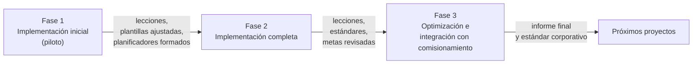
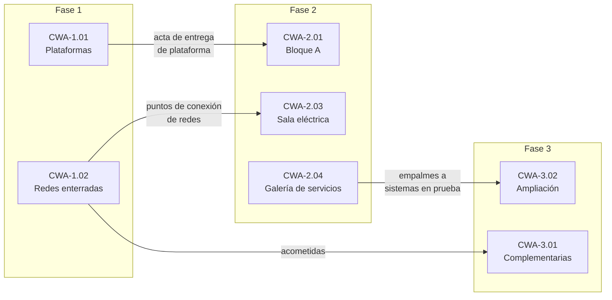

# Aplicación de AWP por fase del proyecto

AWP se implementa **de forma progresiva**. La Fase 1 funciona como fase piloto: tiene menor complejidad y permite probar procesos, plantillas y roles. La Fase 2 aplica AWP de forma completa, y la Fase 3 lo optimiza y lo integra con el comisionamiento del complejo.

## Resumen de la escala por fase

| Aspecto | Fase 1 – Infraestructura | Fase 2 – Instalación principal | Fase 3 – Complementarias y ampliación |
|---|---|---|---|
| Objetivo AWP | Probar el proceso y formar al equipo | Aplicar AWP completo en todas las disciplinas | Optimizar, estandarizar e integrar con comisionamiento |
| Nivel de madurez objetivo | 2 – Básico | 3 – Integrado | 4 – Optimizado |
| CWA / CWP (aprox.) | 3 CWA / 12 CWP | 4 CWA / 45 CWP | 3 CWA / 20 CWP |
| IWP (aprox.) | 180 | 900 | 350 |
| Herramientas | Plantillas Excel del kit, cronograma CPM | Software de WFP enlazado al modelo 3D, cronograma y materiales | Igual que Fase 2, más paneles de KPI automáticos |
| Modelo 3D | Modelo civil y de redes (básico) | Modelo multidisciplina con atributos AWP | Modelo integrado con sistemas de comisionamiento |
| Planificadores de frente de trabajo | 4 | 17 | 8 |
| Backlog objetivo | ≥ 2 semanas | 2 a 4 semanas | 3 a 4 semanas |
| Comisionamiento | Entrega por áreas (redes, subestación de obra) | Entrega por sistemas (SWP) | Comisionamiento integral del complejo |
| Auditoría AWP | Al 30 % y al cierre | Al 20 %, 50 % y cierre | Al 30 % y cierre |

## Fase 1 – Implementación inicial

**Qué se implementa:**

- Designación del AWP Champion, Líder de WFP y primeros planificadores de frente de trabajo; formación básica del equipo (cliente, contratista y subcontratistas).
- CWA y Path of Construction de la Fase 1, y **esquema preliminar** de CWA de las Fases 2 y 3 (para que la Fase 1 deje las plataformas y redes en el orden que las necesita la Fase 2).
- CWP, EWP y PWP por paquete para movimiento de tierras, redes enterradas y vías.
- IWP con las plantillas del kit, registro de restricciones, lookahead de 3 semanas y reunión semanal de restricciones.
- KPI mínimos: IWP liberados sin restricciones, PPC, restricciones vencidas, backlog y EWP a tiempo.
- Línea base de productividad con un estudio de *tool time* al inicio de la construcción.

**Particularidades:** la obra civil masiva tiene pocas disciplinas y mucha dependencia de equipos pesados y del clima. Los IWP se definen por frente y volumen (por ejemplo, "excavación y relleno plataforma norte, ejes 1–5") y las restricciones más frecuentes son permisos, topografía, equipos y acceso.

**Salida hacia la Fase 2:** plantillas ajustadas, codificación validada, planificadores formados que pasan a liderar equipos en la Fase 2 y el primer registro de lecciones aprendidas.

## Fase 2 – Implementación completa

**Qué se ajusta y escala:**

- Se aplica AWP a **todas las disciplinas** y se incorporan subcontratistas de especialidad con requisitos AWP en sus contratos.
- Se incorpora **software de WFP** enlazado al modelo 3D, al cronograma de nivel 5 y al sistema de materiales (la Fase 1 demostró los límites de gestionar cientos de IWP en hojas de cálculo).
- El **Path of Construction** se desarrolla por sistemas: primero la sala eléctrica y los servicios que permiten energizar temprano, luego los bloques A y B.
- Se aplican **plazos de restricciones de proyecto grande** (IWP iniciado 12 semanas antes) y un backlog de 2 a 4 semanas.
- Se mide *tool time* dos veces por año y se agregan KPI de materiales, retrabajo y avance de sistemas.
- Se aplican las lecciones de la Fase 1 antes de liberar el primer IWP de la Fase 2 (ver [Lecciones aprendidas](lecciones-aprendidas.md)).

**Particularidades:** alta densidad de disciplinas en áreas reducidas. Las restricciones más frecuentes son ingeniería incompleta, documentación del proveedor, materiales identificados con *tag*, andamios, grúas e interferencias entre cuadrillas.

## Fase 3 – Optimización e integración

**Qué se ajusta y escala:**

- Se reutilizan CWP y EWP tipo de la Fase 2 para la **ampliación** (mismos criterios de paquete y plantillas prellenadas).
- Se revisa la proporción de planificadores y las metas de KPI según los resultados de la Fase 2.
- El Path of Construction se **integra con la secuencia de comisionamiento** de todo el complejo: los IWP se agrupan por sistema y se preparan los SWP y TOP.
- Se gestionan **trabajos en caliente o empalmes** con sistemas de la Fase 2 en prueba u operación, con permisos específicos como restricción obligatoria.
- Se consolida el estándar AWP del cliente y del contratista para proyectos futuros.

**Particularidades:** trabajo en paralelo con la Fase 2, espacios de acopio compartidos y empalmes a sistemas existentes. Las restricciones más frecuentes son permisos de trabajo, accesos compartidos, disponibilidad de grúas y paradas de sistemas.

## Gestión de interfaces entre fases superpuestas

Cuando dos fases se ejecutan al mismo tiempo, las interfaces se gestionan como **restricciones explícitas** y con reuniones conjuntas.

| Mecanismo | Descripción | Responsable |
|---|---|---|
| **Registro único de restricciones** | Un solo registro para todas las fases, con la columna *Fase del proyecto*. Las restricciones de interfaz se identifican con el tipo "Interfaz entre fases". | Líder de WFP |
| **CWP de interfaz** | Los trabajos en el límite entre fases (por ejemplo, conexión de redes de la Fase 1 con la instalación principal) se agrupan en CWP propios con fecha de entrega acordada. | AWP Champion |
| **Actas de entrega de área** | La Fase 1 entrega cada plataforma o red a la Fase 2 con un acta (topografía, pruebas, planos *as built*). La entrega es un hito del PoC de ambas fases. | Gerente de Construcción |
| **Reunión conjunta de lookahead** | Durante la superposición, la reunión semanal de lookahead revisa ambas fases juntas para resolver conflictos de acceso, grúas, andamios y almacenes. | Gerente de Construcción |
| **Tablero común de recursos compartidos** | Grúas, andamios, zonas de acopio y planificadores se asignan con un tablero común. | Controles del proyecto |
| **Matriz de interfaces** | Lista de puntos de conexión físicos y de información entre fases, con fecha requerida y estado. | Líder de Ingeniería |

