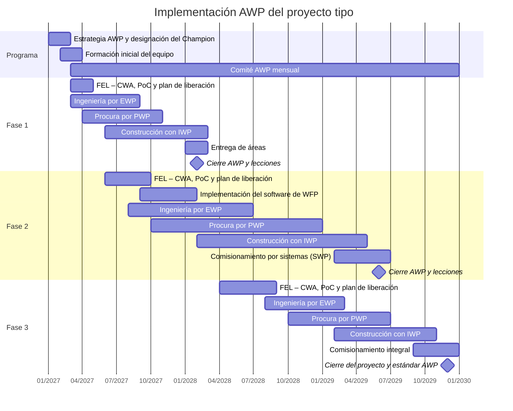

# Cronograma de implementación

El cronograma resume las actividades de implementación AWP por fase del proyecto y por etapa del ciclo de vida. Los meses se cuentan desde el inicio de la planificación temprana global (M1). En los diagramas, M1 se representa como 01/2027; las fechas son solo referenciales.

## Vista general

## Actividades por fase

| Fase / programa | Actividad de implementación | Etapa del ciclo de vida | Inicio | Fin | Responsable |
|---|---|---|---|---|---|
| Programa | Aprobar la estrategia AWP y designar al AWP Champion (H0) | Planificación temprana (FEL) | M1 | M2 | Cliente |
| Programa | Formación inicial del equipo AWP | Planificación temprana (FEL) | M2 | M3 | AWP Champion |
| Fase 1 | Definir CWA y PoC; plan de liberación CWP/EWP/PWP (H1–H3) | Planificación temprana (FEL) | M3 | M4 | AWP Champion |
| Fase 1 | Ingeniería por EWP en secuencia (H5) | Ingeniería | M3 | M8 | Líder de Ingeniería |
| Fase 1 | Procura por PWP | Procura | M4 | M10 | Líder de Procura |
| Fase 1 | Construcción con IWP; primer IWP liberado (H7) | Construcción | M6 | M14 | Gerente de Construcción |
| Fase 1 | Entrega de áreas a la Fase 2 (H9) | Comisionamiento | M13 | M14 | Líder de comisionamiento |
| Fase 1 | Cierre AWP y lecciones (H10) | Comisionamiento | M14 | M14 | AWP Champion |
| Fase 2 | Definir CWA y PoC por sistemas (H1–H3) | Planificación temprana (FEL) | M6 | M9 | AWP Champion |
| Fase 2 | Implementar el software de WFP e integrar modelo, cronograma y materiales | Planificación temprana (FEL) | M9 | M13 | Coordinador de IM |
| Fase 2 | Ingeniería por EWP (H5) | Ingeniería | M8 | M18 | Líder de Ingeniería |
| Fase 2 | Procura por PWP | Procura | M10 | M24 | Líder de Procura |
| Fase 2 | Construcción con IWP (H6–H8) | Construcción | M14 | M28 | Gerente de Construcción |
| Fase 2 | Comisionamiento por sistemas (H9) | Comisionamiento | M26 | M30 | Líder de comisionamiento |
| Fase 2 | Cierre AWP y lecciones (H10) | Comisionamiento | M30 | M30 | AWP Champion |
| Fase 3 | Definir CWA y PoC integrado con comisionamiento (H1–H3) | Planificación temprana (FEL) | M16 | M21 | AWP Champion |
| Fase 3 | Ingeniería por EWP con paquetes tipo de la Fase 2 | Ingeniería | M20 | M26 | Líder de Ingeniería |
| Fase 3 | Procura por PWP | Procura | M22 | M30 | Líder de Procura |
| Fase 3 | Construcción con IWP (H6–H8) | Construcción | M26 | M34 | Gerente de Construcción |
| Fase 3 | Comisionamiento integral (H9) | Comisionamiento | M33 | M36 | Líder de comisionamiento |
| Fase 3 | Cierre del proyecto y estándar AWP (H10) | Comisionamiento | M36 | M36 | AWP Champion |

## Auditorías AWP

| Fase | Momento | Alcance |
|---|---|---|
| Fase 1 | 30 % de construcción (M9) y cierre (M14) | Proceso completo de WFP, restricciones y liberación. |
| Fase 2 | 20 % (M17), 50 % (M21) y cierre (M30) | Integración de ingeniería, procura y WFP; software; subcontratistas. |
| Fase 3 | 30 % (M28) y cierre (M36) | Integración con comisionamiento y aplicación de lecciones. |
