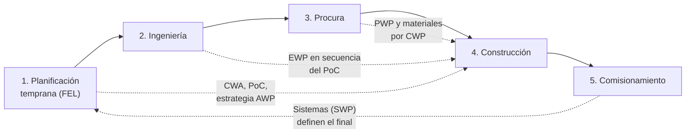

# Etapas del ciclo de vida

AWP no es una actividad de construcción: empieza en la **planificación temprana (FEL)** y acompaña al trabajo hasta el **comisionamiento**. Cada fase del proyecto tipo recorre estas cinco etapas del ciclo de vida. Esta página describe las actividades AWP de cada etapa; la página [Aplicación por fase del proyecto](aplicacion-por-fase.md) explica cómo se aplican en la Fase 1, la Fase 2 y la Fase 3.

La flecha de retorno indica un principio clave de las fuentes: la **secuencia de construcción y de puesta en marcha** se define al inicio y **dirige** a la ingeniería y la procura, no al revés.

## Resumen por etapa

| Etapa del ciclo de vida | Propósito AWP | Paquetes que se generan | Entregables AWP principales | Líder |
|---|---|---|---|---|
| Planificación temprana (FEL) | Definir la estrategia AWP y la secuencia de construcción. | CWA, lista preliminar de CWP | Plan de implementación AWP, CWA, Path of Construction, plan de liberación CWP/EWP/PWP, requisitos AWP para contratos | Cliente y AWP Champion |
| Ingeniería | Entregar la ingeniería en paquetes y en el orden del PoC. | EWP | EWP emitidos IFC por CWP, modelo 3D con atributos, listas de materiales (MTO) por CWP | Líder de Ingeniería |
| Procura | Comprar y entregar materiales por paquete y a tiempo. | PWP | PWP por CWP, fechas RAS alineadas con el PoC, seguimiento de materiales por CWP/IWP | Líder de Procura |
| Construcción | Convertir CWP en IWP libres de restricciones y ejecutarlos. | CWP detallados, IWP | CWP emitidos, IWP liberados, backlog, lookahead de 3 semanas, registro de restricciones, KPI | Gerente de Construcción y Líder de WFP |
| Comisionamiento | Entregar por sistemas, en la secuencia de puesta en marcha. | SWP / TOP | Sistemas definidos, relación IWP ↔ sistema, dossiers de entrega, lecciones de la fase | Líder de comisionamiento |

## 1. Planificación temprana (FEL)

Según el CII, el mayor valor de AWP se captura en esta etapa: aquí se decide **cómo se va a construir** antes de que la ingeniería avance.

Actividades AWP:

1. **Designar al AWP Champion** y formar el equipo AWP (cliente y contratista).
2. **Evaluar la escala de AWP** que conviene al proyecto (modelo de AWP escalable de la COAA) y definir el nivel de madurez objetivo por fase.
3. **Dividir el proyecto en CWA** siguiendo límites físicos y lógicos (ver la plantilla *Definicion_CWA.xlsx*).
4. **Desarrollar el Path of Construction (PoC)** en talleres de planificación interactiva (IPP) con construcción, ingeniería, procura, comisionamiento y el cliente. El PoC se desarrolla en FEL 2 y se congela en FEL 3.
5. **Elaborar la lista preliminar de CWP** y el **plan de liberación CWP/EWP/PWP** (qué paquete se necesita y cuándo).
6. **Definir la estructura de desglose del trabajo (WBS)** y la codificación común de paquetes para todas las disciplinas y sistemas de información.
7. **Incluir los requisitos AWP en los contratos**: cronograma de nivel 3 por CWP y de nivel 5 por IWP, dotación de planificadores, entrega de EWP por paquete, reportes.
8. **Definir los requisitos de gestión de la información**: modelo 3D, atributos, integración con cronograma y materiales.

Entregables: plan de implementación AWP aprobado, CWA definidas, PoC aprobado, plan de liberación de paquetes y cláusulas contractuales AWP.

## 2. Ingeniería

Actividades AWP:

1. **Planificar la ingeniería por EWP**, cada uno ligado a un único CWP y con una fecha requerida calculada hacia atrás desde el inicio del CWP (*Path of Engineering*).
2. **Priorizar los EWP según el PoC**: primero los que alimentan los CWP tempranos y las compras de largo plazo.
3. **Emitir los EWP completos**: planos IFC, especificaciones, listas de materiales (MTO) y datos del proveedor necesarios para construir.
4. **Mantener el modelo 3D con atributos** (código de CWA, CWP e IWP; estado de ingeniería; estado de materiales) para que los planificadores puedan armar los IWP.
5. **Revisiones de constructabilidad** con construcción antes de la emisión IFC.
6. **Gestionar las RFI** como restricciones de ingeniería en el registro de restricciones.

Entregables: EWP emitidos IFC en secuencia, MTO por CWP, modelo 3D actualizado, registro de RFI.

## 3. Procura

Actividades AWP:

1. **Estructurar las compras en PWP** alineados con los CWP (materiales a granel, materiales identificados con *tag* y equipos).
2. **Fijar fechas requeridas en obra (RAS)** a partir del PoC y del plan de liberación de CWP, no del avance de ingeniería.
3. **Seguir el estado de materiales por CWP e IWP**: comprado, en fabricación, en tránsito, recibido, disponible para despacho.
4. **Reservar materiales para IWP** y preparar entregas por paquete (*bag and tag*) cuando el IWP entra al lookahead de 3 semanas.
5. **Gestionar la documentación del proveedor** que construcción necesita (planos certificados, manuales, certificados de calidad).

Entregables: PWP emitidos, fechas RAS alineadas, reporte de disponibilidad de materiales por CWP/IWP.

## 4. Construcción

Actividades AWP (Workface Planning):

1. **Emitir los CWP** con alcance, planos, cantidades, horas estimadas, secuencia, riesgos de seguridad y requisitos de calidad.
2. **Dividir los CWP en IWP** (una cuadrilla, un capataz, alrededor de una semana de trabajo) dentro de una ventana de planificación de unas 12 semanas.
3. **Identificar, asignar y levantar restricciones** de cada IWP con el registro de restricciones y la reunión semanal de restricciones.
4. **Liberar a campo solo IWP sin restricciones** y mantener un **backlog de 2 a 4 semanas** de IWP listos, con trabajo de "plan B".
5. **Planificar con el lookahead de 3 semanas** y el plan semanal; los superintendentes seleccionan IWP del backlog.
6. **Registrar avance, horas y causas de no cumplimiento** por IWP y cerrar cada IWP con su documentación de calidad.
7. **Medir los KPI** (PPC, restricciones, backlog, *tool time*, productividad) y reportarlos cada semana.

Entregables: CWP e IWP emitidos, backlog, lookahead, registro de restricciones actualizado, reporte semanal de KPI.

## 5. Comisionamiento

Actividades AWP:

1. **Definir los sistemas y subsistemas** y su secuencia de puesta en marcha desde la planificación temprana, para que el PoC termine en sistemas completos.
2. **Relacionar IWP y sistemas**: cada IWP indica a qué sistema pertenece, para saber qué falta para completar cada uno.
3. **Preparar los paquetes de sistema (SWP) y de entrega (TOP)** con registros de inspección y pruebas (ITR), listas de pendientes y dossiers.
4. **Cerrar la fase** con el informe de cierre AWP y el registro de lecciones aprendidas para la fase siguiente.

Entregables: SWP y TOP, sistemas entregados, informe de cierre de fase y lecciones aprendidas.

## Cronograma de las restricciones de un IWP

El marco educativo del CII propone plazos distintos según el tamaño del proyecto. El proyecto tipo adopta el esquema de **proyecto grande** para la Fase 2 y un esquema intermedio para las Fases 1 y 3:

| Hito del IWP | Fase 1 y Fase 3 | Fase 2 | Referencia CII (grande) |
|---|---|---|---|
| IWP iniciado (alcance definido) | 8 semanas antes | 12 semanas antes | 12 semanas |
| Restricciones identificadas | 6 semanas antes | 10 semanas antes | 10 semanas |
| Restricciones asignadas | 5 semanas antes | 8 semanas antes | 8 semanas |
| Restricciones levantadas | 3 semanas antes | 4 semanas antes | 4 semanas |
| IWP liberado (en backlog) | 2 semanas antes | 2 a 4 semanas antes | Después de levantar las restricciones |
