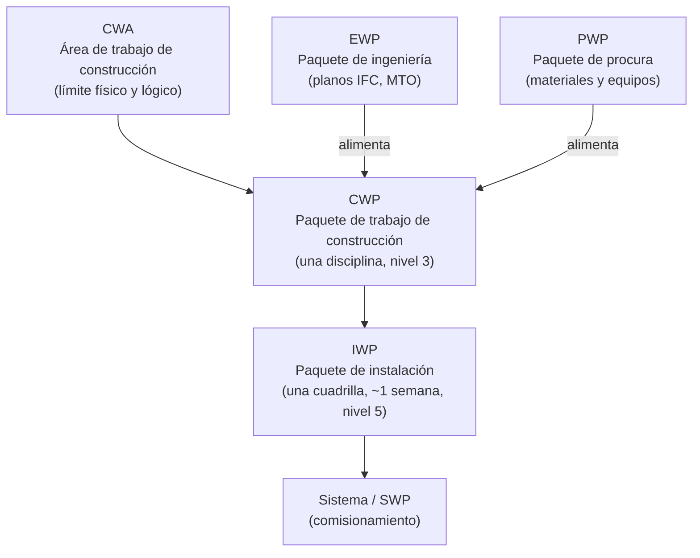
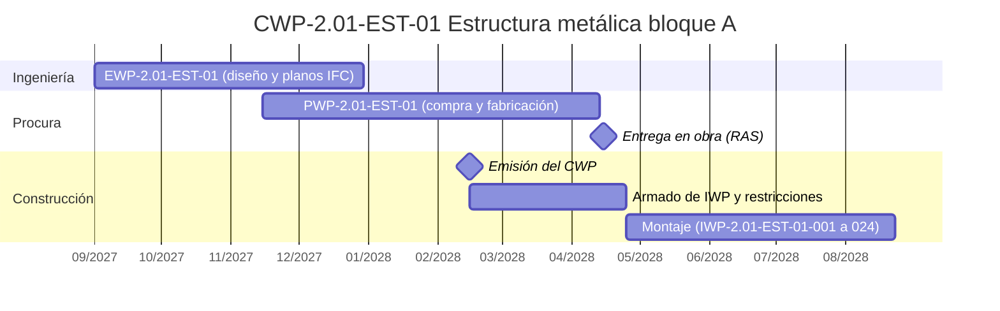
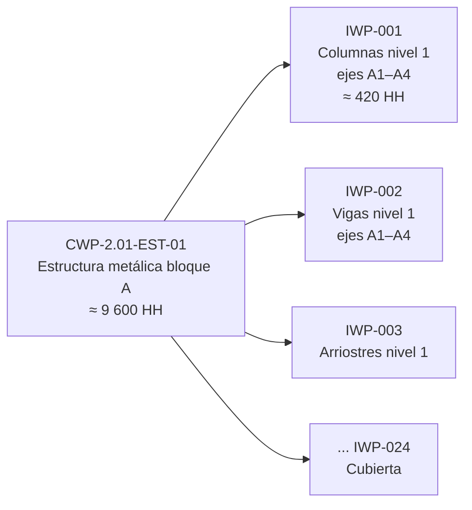

# Flujo de paquetes

AWP organiza todo el trabajo en una jerarquía de paquetes. La **construcción define qué paquetes necesita y cuándo**; ingeniería y procura entregan sus paquetes para que cada CWP pueda iniciarse completo.

## Definición y reglas de cada paquete

| Paquete | Qué es | Reglas del proyecto tipo | Nivel de cronograma | Lo prepara |
|---|---|---|---|---|
| **CWA** | Área geográfica o lógica del proyecto, delimitada para organizar la secuencia de construcción. | Sin superposición entre CWA; límites definidos en plano; una CWA pertenece a una sola fase. | Nivel 2 | AWP Champion y construcción |
| **CWP** | Parte de una CWA de **una sola disciplina**, con alcance y entregables definidos. | Menos de 40 000 HH; una actividad de nivel 3; sin superposición entre CWP; puede ser límite contractual. | Nivel 3 | Construcción |
| **EWP** | Entregables de ingeniería necesarios para un CWP (planos, especificaciones, MTO). | Relación 1 EWP = 1 CWP (se admite más de un EWP por CWP solo si se justifica); fecha requerida = inicio del CWP menos el plazo de procura y preparación. | Nivel 3 (ingeniería) | Ingeniería |
| **PWP** | Materiales, equipos y servicios que requiere un CWP, con su documentación del proveedor. | Relación 1 PWP = 1 CWP; materiales a granel agrupados por CWP; equipos con *tag*; fechas RAS desde el PoC. | Nivel 3 (procura) | Procura |
| **IWP** | Porción de trabajo de un CWP que ejecuta **un capataz y su cuadrilla** en alrededor de una semana. | 1 IWP pertenece a 1 CWP; entre 300 y 600 HH; solo se libera sin restricciones abiertas; se cierra con avance y calidad. | Nivel 5 | Planificador de frente de trabajo |
| **SWP / TOP** | Paquetes de sistema y de entrega para comisionamiento. | Cada IWP indica su sistema; el SWP se prepara cuando los IWP del sistema están cerrados. | — | Comisionamiento |

!!! note "Sobre las diferencias entre fuentes"
    Las fuentes no coinciden en el nivel de cronograma del IWP (nivel 5 en Insight-AWP, nivel 4 en el glosario del CII) ni en su duración (una semana, una a dos semanas o unas 500 HH). El proyecto tipo adopta **nivel 5** y **alrededor de una semana (300 a 600 HH)**, según el [índice de fuentes](../acerca/indice-de-fuentes.md).

## Codificación de paquetes

Todos los paquetes usan una codificación jerárquica que permite saber, solo por el código, a qué fase, área y disciplina pertenecen:

| Paquete | Formato | Ejemplo |
|---|---|---|
| CWA | `CWA-<fase>.<nn>` | CWA-2.01 |
| CWP | `CWP-<fase>.<nn>-<disciplina>-<nn>` | CWP-2.01-EST-01 |
| EWP | `EWP-<fase>.<nn>-<disciplina>-<nn>` (mismo sufijo que su CWP) | EWP-2.01-EST-01 |
| PWP | `PWP-<fase>.<nn>-<disciplina>-<nn>` (mismo sufijo que su CWP) | PWP-2.01-EST-01 |
| IWP | `IWP-<fase>.<nn>-<disciplina>-<nn>-<nnn>` | IWP-2.01-EST-01-001 |

Códigos de disciplina: **CIV** civil, **EST** estructuras, **ARQ** arquitectura, **MEC** mecánica, **TUB** tuberías, **ELE** eléctrica, **INS** instrumentación y control.

## Ejemplos del proyecto tipo

Los mismos paquetes aparecen como filas de ejemplo en las plantillas *Seguimiento_Paquetes.xlsx*, *Registro_Restricciones.xlsx* y *Programa_Liberacion_IWP.xlsx*.

| Fase | CWA | CWP | EWP | PWP | IWP de ejemplo |
|---|---|---|---|---|---|
| Fase 1 | CWA-1.01 Plataformas | CWP-1.01-CIV-01 Movimiento de tierras plataforma norte | EWP-1.01-CIV-01 | PWP-1.01-CIV-01 (material de préstamo, geotextil) | IWP-1.01-CIV-01-001 Excavación masiva ejes 1–5 |
| Fase 1 | CWA-1.02 Redes enterradas | CWP-1.02-TUB-01 Redes de agua y desagüe | EWP-1.02-TUB-01 | PWP-1.02-TUB-01 (tubería HDPE, accesorios) | IWP-1.02-TUB-01-001 Tubería de agua tramo T1 |
| Fase 1 | CWA-1.02 Redes enterradas | CWP-1.02-ELE-01 Bancos de ductos eléctricos | EWP-1.02-ELE-01 | PWP-1.02-ELE-01 (ductos, buzones prefabricados) | IWP-1.02-ELE-01-001 Banco de ductos BD-01 a BD-04 |
| Fase 2 | CWA-2.01 Bloque A | CWP-2.01-CIV-01 Cimentaciones bloque A | EWP-2.01-CIV-01 | PWP-2.01-CIV-01 (acero de refuerzo, pernos de anclaje) | IWP-2.01-CIV-01-001 Zapatas ejes A1–A4 |
| Fase 2 | CWA-2.01 Bloque A | CWP-2.01-EST-01 Estructura metálica bloque A | EWP-2.01-EST-01 | PWP-2.01-EST-01 (estructura fabricada, pernos) | IWP-2.01-EST-01-001 Montaje de columnas nivel 1 ejes A1–A4 |
| Fase 2 | CWA-2.01 Bloque A | CWP-2.01-TUB-01 Tuberías de servicios bloque A | EWP-2.01-TUB-01 | PWP-2.01-TUB-01 (tubería, válvulas con *tag*) | IWP-2.01-TUB-01-001 Tubería de agua de servicio nivel 1 |
| Fase 2 | CWA-2.03 Sala eléctrica | CWP-2.03-ELE-01 Equipos y cableado de sala eléctrica | EWP-2.03-ELE-01 | PWP-2.03-ELE-01 (tableros, transformadores, cables) | IWP-2.03-ELE-01-001 Montaje de tableros de media tensión |
| Fase 3 | CWA-3.01 Complementarias | CWP-3.01-ARQ-01 Arquitectura edificio de oficinas | EWP-3.01-ARQ-01 | PWP-3.01-ARQ-01 (tabiquería, carpintería) | IWP-3.01-ARQ-01-001 Tabiquería nivel 1 |
| Fase 3 | CWA-3.02 Ampliación | CWP-3.02-CIV-01 Cimentaciones de la ampliación | EWP-3.02-CIV-01 | PWP-3.02-CIV-01 (acero de refuerzo, concreto) | IWP-3.02-CIV-01-001 Zapatas ejes C1–C3 |
| Fase 3 | CWA-3.02 Ampliación | CWP-3.02-TUB-01 Empalmes a la galería de servicios | EWP-3.02-TUB-01 | PWP-3.02-TUB-01 (accesorios, válvulas) | IWP-3.02-TUB-01-001 Empalme de línea de agua a galería 2.04 |

## Secuencia de un CWP en el tiempo

Ejemplo del CWP-2.01-EST-01 (estructura metálica del bloque A), calculado hacia atrás desde la fecha de inicio de montaje que fija el PoC:

Reglas aplicadas:

- El EWP se emite IFC al menos **3 meses antes** del inicio de montaje, para permitir la fabricación.
- El CWP se emite **10 semanas antes** del inicio, para que los planificadores armen los IWP y levanten restricciones.
- La fecha RAS de la estructura es **10 días antes** del primer IWP de montaje.

## Del CWP a los IWP

Cada IWP contiene: alcance y cantidades, planos y vistas 3D, lista de materiales reservados, secuencia de pasos, cuadrilla y horas estimadas, análisis de riesgos (JHA) y permisos, ITP y registros de calidad, equipos y andamios, y la hoja de cierre. Ver la plantilla *Plantilla_IWP.docx*.
