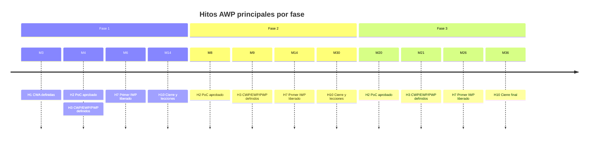

# Hitos clave por fase

Los hitos AWP se incluyen en el **cronograma maestro** del proyecto y se revisan en la reunión mensual de gestión. Un hito solo se da por cumplido cuando se verifica su **criterio de cumplimiento** y existe la **evidencia** indicada.

## Hitos AWP tipo

Los mismos hitos se repiten en cada fase del proyecto, lo que permite comparar el desempeño entre fases.

| Código | Hito | Criterio de cumplimiento | Evidencia | Aprueba |
|---|---|---|---|---|
| H0 | Estrategia AWP aprobada (programa) | Plan de implementación AWP firmado; AWP Champion designado; nivel de madurez objetivo por fase definido. | Plan firmado, acta de designación | Cliente |
| H1 | CWA definidas | 100 % del alcance de la fase asignado a CWA sin superposiciones; CWA con límites en plano y código. | Plano de CWA, plantilla *Definicion_CWA* | AWP Champion |
| H2 | Path of Construction aprobado | Secuencia de CWA y CWP acordada en taller IPP con construcción, ingeniería, procura y comisionamiento; PoC congelado. | Acta del taller, plantilla *Path_of_Construction* | Cliente y Gerente de Construcción |
| H3 | CWP, EWP y PWP definidos | Lista completa de CWP con su EWP y PWP asociados; fechas requeridas calculadas desde el PoC; plan de liberación publicado. | *Seguimiento_Paquetes* con fechas plan | AWP Champion |
| H4 | Requisitos AWP en contratos | Cláusulas AWP incluidas en contratos y subcontratos de la fase (niveles 3 y 5, planificadores, reportes). | Contratos firmados | Gerente de Proyecto |
| H5 | Primer EWP emitido IFC en secuencia | El EWP del primer CWP del PoC está emitido IFC completo, antes de su fecha requerida. | Transmittal de ingeniería | Líder de Ingeniería |
| H6 | Primer CWP emitido a construcción | CWP completo según la plantilla, con materiales asegurados (PWP) y aprobado. | Plantilla de CWP firmada | Gerente de Construcción |
| H7 | Primer IWP liberado | IWP sin restricciones abiertas, con checklist de liberación firmado, entregado al capataz. | Checklist de liberación, registro de restricciones | Líder de WFP |
| H8 | Backlog estable | Backlog de IWP liberados igual o mayor a la meta de la fase durante 4 semanas seguidas. | Tablero de KPI | Gerente de Construcción |
| H9 | Primer sistema o área entregado | Primer SWP o acta de entrega de área completa, con documentación. | Acta de entrega / SWP | Líder de comisionamiento |
| H10 | Cierre AWP de la fase | Informe de cierre AWP y registro de lecciones aprendidas aprobados y comunicados a la fase siguiente. | Informe de cierre, registro de lecciones | AWP Champion y Cliente |

## Fechas de los hitos por fase

Las fechas se expresan en meses del proyecto (M1 = inicio de la planificación temprana global).

| Hito | Fase 1 | Fase 2 | Fase 3 |
|---|---|---|---|
| H0 Estrategia AWP aprobada | M2 (común a todas las fases) | — | — |
| H1 CWA definidas | M3 | M6 (preliminar en M3) | M16 (preliminar en M3) |
| H2 Path of Construction aprobado | M4 | M8 | M20 |
| H3 CWP, EWP y PWP definidos | M4 | M9 | M21 |
| H4 Requisitos AWP en contratos | M4 | M10 | M22 |
| H5 Primer EWP emitido IFC | M5 | M11 | M23 |
| H6 Primer CWP emitido | M6 | M14 | M26 |
| H7 Primer IWP liberado | M6 | M14 | M26 |
| H8 Backlog estable | M8 | M17 | M28 |
| H9 Primer sistema o área entregado | M12 | M24 | M33 |
| H10 Cierre AWP de la fase | M14 | M30 | M36 |

## Puertas de control entre fases

Además de sus propios hitos, cada fase tiene una **puerta de control** que depende de la fase anterior:

| Puerta | Condición | Momento |
|---|---|---|
| Inicio de construcción de la Fase 2 | Lecciones de los primeros 6 meses de la Fase 1 revisadas e incorporadas a procedimientos y plantillas; actas de entrega de plataformas de CWA-1.01 firmadas. | M14 |
| Aprobación del PoC de la Fase 3 | Lecciones de la Fase 2 (primer año de construcción) revisadas; metas de KPI de la Fase 3 ajustadas con los resultados de la Fase 2. | M20 |
| Cierre del proyecto | Informes de cierre de las tres fases consolidados en un estándar AWP para futuros proyectos. | M36 |
