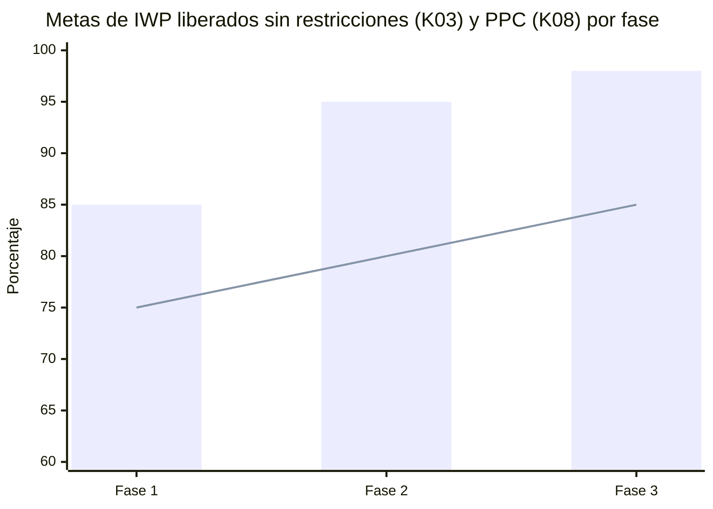

# Indicadores (KPI)

Los KPI miden dos cosas: **si AWP se está implementando** (indicadores de proceso) y **si está mejorando el resultado** (indicadores de resultado). Todos se calculan con la **misma fórmula en las tres fases**, para poder compararlas. La plantilla *Tablero_KPI.xlsx* contiene las fórmulas, las metas por fase y el semáforo.

## Indicadores de proceso (implementación)

| Código | KPI | Fórmula | Frecuencia | Meta F1 | Meta F2 | Meta F3 |
|---|---|---|---|---|---|---|
| K01 | EWP emitidos a tiempo | EWP emitidos IFC en o antes de su fecha requerida ÷ EWP con fecha requerida vencida | Mensual | ≥ 80 % | ≥ 90 % | ≥ 95 % |
| K02 | Materiales disponibles al liberar | IWP liberados con 100 % de materiales ÷ IWP liberados | Semanal | ≥ 90 % | ≥ 95 % | ≥ 98 % |
| K03 | IWP liberados sin restricciones | IWP liberados sin restricciones abiertas ÷ IWP liberados | Semanal | ≥ 85 % | ≥ 95 % | ≥ 98 % |
| K04 | Backlog de IWP liberados | HH de IWP liberados no iniciados ÷ HH promedio ejecutadas por semana | Semanal | ≥ 2 sem. | 2–4 sem. | 3–4 sem. |
| K05 | Restricciones liberadas a tiempo | Restricciones liberadas en o antes de su fecha requerida ÷ restricciones liberadas | Semanal | ≥ 80 % | ≥ 90 % | ≥ 95 % |
| K06 | Atraso promedio de restricciones | Promedio de días de atraso de las restricciones vencidas | Semanal | ≤ 7 días | ≤ 5 días | ≤ 3 días |
| K07 | Cobertura de planificadores | Trabajadores directos ÷ planificadores de frente de trabajo | Mensual | ≤ 55 | ≤ 50 | ≤ 50 |

## Indicadores de resultado (efecto en la productividad)

| Código | KPI | Fórmula | Frecuencia | Meta F1 | Meta F2 | Meta F3 |
|---|---|---|---|---|---|---|
| K08 | Porcentaje de plan cumplido (PPC) | IWP completados en la semana según el plan ÷ IWP planificados en la semana | Semanal | ≥ 75 % | ≥ 80 % | ≥ 85 % |
| K09 | IWP devueltos | IWP retirados de campo sin terminar por restricciones no detectadas ÷ IWP entregados a campo | Semanal | ≤ 8 % | ≤ 5 % | ≤ 3 % |
| K10 | Factor de productividad | HH ganadas ÷ HH gastadas (mayor que 1 es favorable) | Semanal | ≥ 0,95 | ≥ 1,00 | ≥ 1,05 |
| K11 | Tiempo productivo (*tool time*) | Tiempo en trabajo directo ÷ tiempo total observado (estudio de muestreo) | Semestral | ≥ 40 % | ≥ 44 % | ≥ 46 % |
| K12 | Retrabajo | HH de retrabajo ÷ HH gastadas | Mensual | ≤ 4 % | ≤ 3 % | ≤ 2 % |
| K13 | Índice de desempeño del cronograma (SPI) de construcción | Valor ganado ÷ valor planificado | Mensual | ≥ 0,95 | ≥ 0,98 | ≥ 1,00 |

## Cómo comparar las fases

- **Normalizar por tamaño:** los KPI son porcentajes, cocientes o semanas, nunca valores absolutos, para que una fase de 300 000 HH se compare con una de 1 100 000 HH.
- **Comparar en el mismo punto de avance:** además del valor acumulado, comparar los KPI al 25 %, 50 % y 75 % del avance de construcción de cada fase.
- **Separar el aprendizaje:** los primeros dos meses de cada fase se informan aparte, porque incluyen la curva de aprendizaje de personal nuevo.
- **Línea base:** el estudio de *tool time* de la Fase 1 al inicio de la construcción es la línea base del proyecto (valor de referencia del CII: 37 %).

## Semáforo

| Color | Criterio |
|---|---|
| Verde | Cumple la meta de la fase. |
| Ámbar | A menos de 10 % de la meta (por ejemplo, 86 % frente a una meta de 95 %). |
| Rojo | Más de 10 % por debajo de la meta, o dos semanas seguidas en ámbar. |

*Barras: meta de K03. Línea: meta de K08.*
