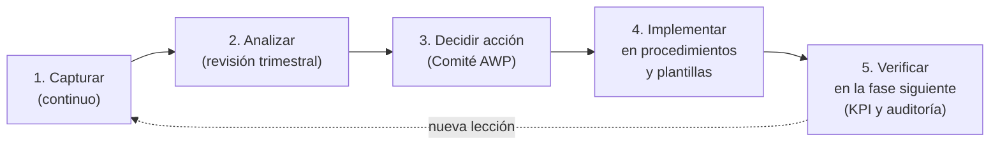

# Lecciones aprendidas entre fases

La superposición de las fases es una ventaja: la Fase 2 puede aplicar lo aprendido en la Fase 1 **antes de liberar su primer IWP**, y la Fase 3 puede aprovechar el primer año de construcción de la Fase 2. Para que eso ocurra, las lecciones se gestionan como un proceso con responsables, fechas y verificación, no como un documento de cierre.

## Proceso

| Paso | Qué se hace | Cuándo | Responsable | Herramienta |
|---|---|---|---|---|
| 1. Capturar | Cualquier persona registra una lección (positiva o negativa) con el evento, la causa y su propuesta. También se capturan en el cierre de cada IWP devuelto y en las auditorías. | Continuo | Todos; el Líder de WFP consolida | *Registro_Lecciones_Aprendidas.xlsx* |
| 2. Analizar | Se agrupan por categoría y etapa del ciclo de vida, se identifica la causa raíz y se valora su impacto. | Trimestral y al cierre de fase | AWP Champion | Taller de lecciones |
| 3. Decidir acción | Se decide si cambia un procedimiento, una plantilla, una meta de KPI, la dotación o un contrato. | Comité AWP mensual | Comité AWP | Acta del comité |
| 4. Implementar | Se actualiza el documento afectado, con control de versiones, y se forma al personal. | Antes de la puerta de control de la fase siguiente | Responsable asignado | Procedimientos y plantillas del kit |
| 5. Verificar | Se comprueba con KPI o auditoría que la acción funcionó en la fase siguiente. | 3 meses después de implementar | AWP Champion | *Tablero_KPI.xlsx*, auditoría |

## Momentos clave de transferencia

| Momento | De → a | Qué se transfiere |
|---|---|---|
| M10 (6 meses de Fase 1) | Fase 1 → Fase 2 | Lecciones de definición de CWA, PoC, codificación, plantillas de IWP y restricciones. Se incorporan antes de H6 de la Fase 2. |
| M14 (cierre de Fase 1) | Fase 1 → Fase 2 | Informe de cierre AWP de la Fase 1, KPI finales, planificadores formados. |
| M20 (1 año de Fase 2) | Fase 2 → Fase 3 | Lecciones de integración de software, materiales, interfaces y metas de KPI; CWP y EWP tipo reutilizables para la ampliación. |
| M30 (cierre de Fase 2) | Fase 2 → Fase 3 | Informe de cierre AWP de la Fase 2; lecciones de comisionamiento por sistemas. |
| M36 (cierre del proyecto) | Proyecto → organización | Estándar AWP consolidado y registro completo de lecciones. |

## Ejemplos de lecciones del proyecto tipo

| ID | Fase de origen | Etapa del ciclo de vida | Lección | Acción en la fase siguiente |
|---|---|---|---|---|
| LA-01 | Fase 1 | Construcción | Los IWP de movimiento de tierras definidos por volumen total eran demasiado grandes (3 semanas); el PPC no reflejaba problemas reales. | Limitar los IWP a 1 semana y a 600 HH; aplicar la regla en la plantilla de IWP de la Fase 2. |
| LA-02 | Fase 1 | Procura | Las órdenes de compra no tenían código de CWP; el almacén no podía reservar materiales por IWP. | Código de CWP obligatorio en órdenes de compra y guías de despacho desde la Fase 2. |
| LA-03 | Fase 1 | Construcción | Los permisos de excavación fueron la restricción más frecuente y se identificaban tarde. | Incluir el permiso como restricción por defecto en la plantilla de IWP y solicitarlo 3 semanas antes. |
| LA-04 | Fase 2 | Ingeniería | La documentación del proveedor de tableros eléctricos llegó después de la emisión del EWP y retrasó IWP de montaje. | Incluir documentación del proveedor como entregable del PWP con fecha propia en la Fase 3. |
| LA-05 | Fase 2 | Construcción | La reunión conjunta de lookahead con la Fase 3 redujo los conflictos de grúas. | Mantenerla y ampliarla a los subcontratistas de la Fase 3. |
| LA-06 | Fase 2 | Comisionamiento | Los IWP no indicaban sistema; fue difícil saber qué faltaba para entregar cada sistema. | Campo *Sistema* obligatorio en IWP y en el seguimiento de paquetes desde el inicio de la Fase 3. |

Las mismas lecciones aparecen como filas de ejemplo en *Registro_Lecciones_Aprendidas.xlsx*.
