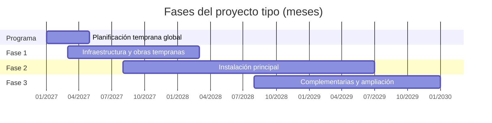
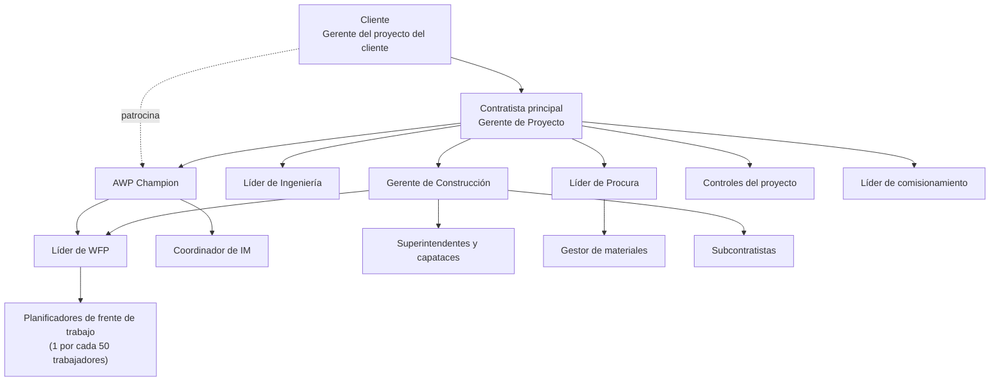

# Proyecto tipo y sus fases

El kit se construye sobre un **proyecto tipo** genérico. Sus supuestos se eligieron para que el plan sirva a cualquier proyecto de construcción (una planta industrial, un hospital, un centro logístico, un centro de datos, una instalación minera o un complejo de edificios): cambian los nombres de las áreas, pero no la lógica de AWP.

!!! note "Cómo adaptar el caso"
    Para aplicar el kit a un proyecto real, reemplaza las áreas, disciplinas, cantidades y fechas de esta página y de las filas de ejemplo de las plantillas. Mantén la codificación de paquetes y la lista de estados, porque todas las plantillas dependen de ellas.

## Descripción general

**Proyecto Tipo (PT): complejo de instalaciones en tres fases.** El proyecto construye un complejo formado por la infraestructura general del terreno, una **instalación principal** (el edificio o planta que da sentido al proyecto) y un conjunto de **edificaciones complementarias**, más una ampliación prevista desde el inicio. El cliente contrata a un **contratista principal** bajo una modalidad de ingeniería, procura y construcción (EPC), que a su vez subcontrata algunas especialidades.

| Supuesto | Valor |
|---|---|
| Duración total | **36 meses** (M1 a M36), incluida la planificación temprana |
| Horas-hombre directas de construcción | ≈ 1 850 000 HH |
| Pico de personal en obra | ≈ 1 100 personas (superposición de Fase 2 y Fase 3) |
| Modalidad contractual | EPC con el contratista principal; subcontratos por especialidad |
| Disciplinas | Civil, estructuras, arquitectura, mecánica, tuberías, eléctrica e instrumentación y control |
| Herramientas | Cronograma CPM (nivel 1 a 5), modelo 3D por disciplina, plantillas del kit; software de WFP a partir de la Fase 2 |

## Fases del proyecto

| Fase del proyecto | Alcance | Meses | Duración | HH directas | Pico de personal |
|---|---|---|---|---|---|
| **Fase 1 – Infraestructura y obras tempranas** | Movimiento de tierras y plataformas, vías de acceso, redes enterradas (agua, desagüe, bancos de ductos eléctricos), instalaciones temporales y subestación de alimentación de obra. | M3 – M14 | 12 meses | 300 000 | 220 |
| **Fase 2 – Instalación principal** | Cimentaciones, estructura, arquitectura, equipos, tuberías, sistemas eléctricos e instrumentación de la instalación principal (bloques A y B), sala eléctrica y galería de servicios que la interconecta. | M8 – M30 | 23 meses | 1 100 000 | 850 |
| **Fase 3 – Edificaciones complementarias y ampliación** | Edificios auxiliares (almacén, oficinas, talleres), ampliación de la instalación principal, urbanización y obras exteriores finales, y comisionamiento integral del complejo. | M20 – M36 | 17 meses | 450 000 | 380 |

La planificación temprana global del programa ocupa los meses **M1 a M4** y define la estrategia AWP para las tres fases. Después, cada fase tiene su propia planificación temprana (FEL) antes de su ingeniería de detalle: la de la Fase 1 ocurre dentro de su periodo (M3–M4), mientras que las de la Fase 2 (desde M6) y la Fase 3 (desde M16) empiezan antes del periodo de ejecución indicado en la tabla, en paralelo con la fase anterior.

## Relación entre las fases

*En los diagramas de cronograma, el mes M1 del proyecto se representa como 01/2027; las fechas son solo referenciales.*

Las fases se **superponen**. Mientras una fase construye, la siguiente está en ingeniería y procura, lo que permite trasladar lecciones aprendidas casi en tiempo real:

| Superposición | Meses | Qué ocurre | Interfaz principal |
|---|---|---|---|
| Fase 1 → Fase 2 | M8 – M14 | La Fase 1 construye plataformas y redes mientras la Fase 2 desarrolla su ingeniería y compra equipos de largo plazo. | Entrega de plataformas y puntos de conexión de redes (CWA 1.01 y 1.02) a la Fase 2. |
| Fase 2 → Fase 3 | M20 – M30 | La Fase 2 está en el pico de construcción mientras la Fase 3 hace su ingeniería y compras e inicia obras civiles. | Interconexiones de la galería de servicios (CWA 2.04) y compartición de accesos, grúas y zonas de acopio. |
| Fase 1, 2 y 3 | M33 – M36 | Comisionamiento integral del complejo. | Entrega por sistemas (SWP) y documentación de cierre (*turnover*). |

Dependencias clave:

- **Fase 1 es predecesora física** de la Fase 2: sin plataformas ni redes enterradas no puede iniciarse la cimentación de la instalación principal.
- **Fase 2 y Fase 3 comparten recursos**: grúas, andamios, almacenes, planificadores y supervisión. Se requiere un único registro de restricciones y un tablero común de recursos.
- **Fase 3 amplía sistemas de la Fase 2**: los empalmes a sistemas en operación o en prueba necesitan permisos y coordinación con comisionamiento.

## Áreas de trabajo de construcción (CWA)

Cada fase se divide en CWA. La codificación es `CWA-<fase>.<correlativo>`:

| Fase del proyecto | Código CWA | Nombre | Disciplinas principales |
|---|---|---|---|
| Fase 1 | CWA-1.01 | Plataformas y movimiento de tierras | Civil |
| Fase 1 | CWA-1.02 | Redes enterradas | Civil, tuberías, eléctrica |
| Fase 1 | CWA-1.03 | Vías de acceso e instalaciones temporales | Civil, eléctrica, arquitectura |
| Fase 2 | CWA-2.01 | Instalación principal – bloque A | Todas |
| Fase 2 | CWA-2.02 | Instalación principal – bloque B | Todas |
| Fase 2 | CWA-2.03 | Sala eléctrica y de servicios | Civil, estructuras, eléctrica, instrumentación |
| Fase 2 | CWA-2.04 | Galería de servicios e interconexiones | Estructuras, tuberías, eléctrica |
| Fase 3 | CWA-3.01 | Edificaciones complementarias | Civil, estructuras, arquitectura, eléctrica |
| Fase 3 | CWA-3.02 | Ampliación de la instalación principal | Todas |
| Fase 3 | CWA-3.03 | Urbanización y obras exteriores | Civil, eléctrica |

## Organización del proyecto

La organización es **única para las tres fases**: los líderes funcionales y el AWP Champion permanecen durante todo el proyecto, mientras que los planificadores de frente de trabajo, superintendentes y cuadrillas se asignan a cada fase según la curva de personal. El detalle de roles está en [Organización y roles](organizacion.md).

## Dotación de planificadores de frente de trabajo

Con la proporción de referencia de **un planificador por cada 50 trabajadores** (procedimiento 3.0 y guías de inicio rápido):

| Fase del proyecto | Pico de personal | Planificadores en el pico | Observación |
|---|---|---|---|
| Fase 1 | 220 | 4 | Incluye un planificador líder que actúa como Líder de WFP. |
| Fase 2 | 850 | 17 | Parte del equipo proviene de la Fase 1 (transferencia de experiencia). |
| Fase 3 | 380 | 8 | Se ajusta la proporción según los resultados de la Fase 2. |
