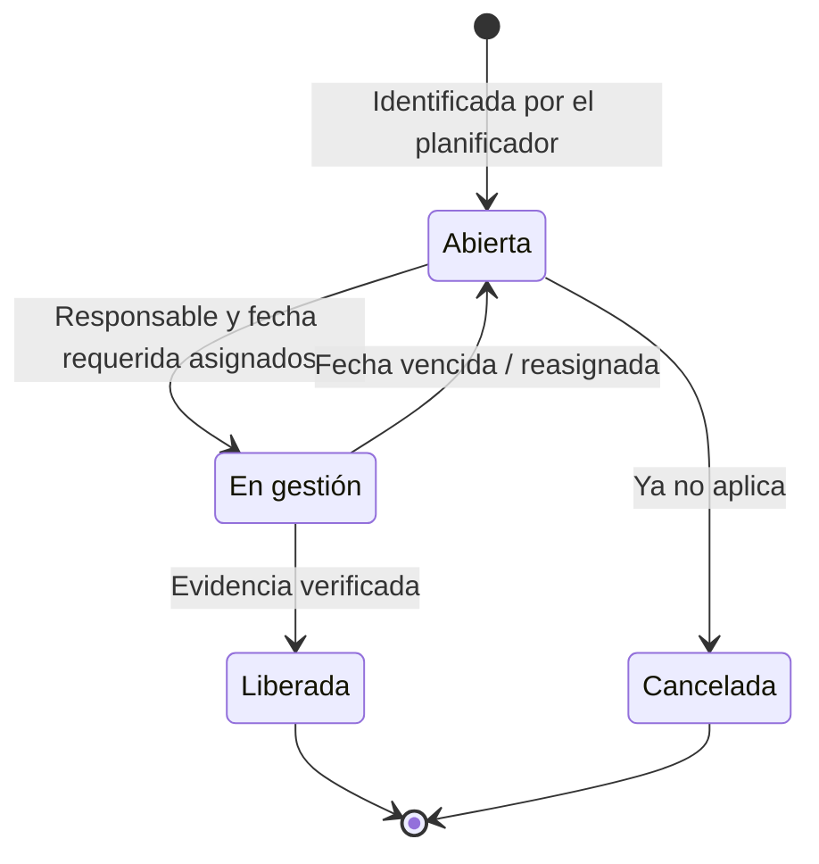
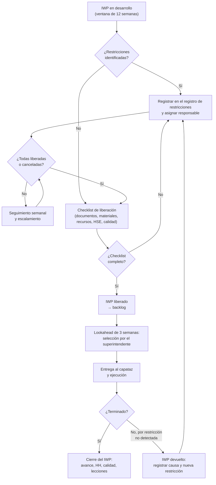

# Gestión de restricciones y liberación de IWP

**Regla de oro de WFP:** ningún IWP se entrega a campo con restricciones abiertas. Una **restricción** es cualquier información, material, equipo, permiso, acceso u otro factor que impida o retrase la ejecución segura y completa del trabajo (marco educativo del CII).

El procedimiento detallado está en *Procedimiento_Gestion_Restricciones.docx* y el registro en *Registro_Restricciones.xlsx*.

## Tipos de restricción

La lista es la misma en todas las plantillas del kit:

| Tipo | Ejemplos | Responsable habitual |
|---|---|---|
| Ingeniería | Plano no emitido IFC, RFI abierta, revisión pendiente | Líder de Ingeniería |
| Materiales | Material no recibido, no conforme o no reservado | Líder de Procura / Gestor de materiales |
| Equipos de construcción | Grúa, plataforma elevadora o equipo pesado no disponible | Gerente de Construcción |
| Permisos | Permiso de trabajo, excavación, trabajo en caliente, licencia municipal | Líder de HSE |
| Mano de obra | Cuadrilla o especialista no disponible, acreditaciones | Superintendente |
| Andamios | Andamio no solicitado, no montado o no inspeccionado | Superintendente |
| Acceso / interferencias | Frente ocupado por otra cuadrilla, vía cerrada | Gerente de Construcción |
| Trabajos predecesores | Trabajo previo no terminado o no liberado por calidad | Superintendente |
| Calidad | ITP no aprobado, procedimiento de soldadura no calificado | Líder de calidad |
| HSE | JHA no aprobado, plan de izaje pendiente | Líder de HSE |
| Documentación del proveedor | Planos certificados o manual de montaje pendientes | Líder de Procura |
| Interfaz entre fases | Entrega de área o conexión pendiente de otra fase | AWP Champion |

## Ciclo de vida de una restricción

Estados usados en el registro: **Abierta**, **En gestión**, **Liberada** y **Cancelada**. Una restricción está **vencida** cuando no está liberada ni cancelada y su fecha requerida ya pasó; el registro calcula los **días de atraso** y la marca en rojo.

## Proceso semanal

| Día | Actividad | Responsable |
|---|---|---|
| Lunes | Los planificadores actualizan el registro con restricciones nuevas de los IWP que entran a la ventana de 12 semanas. | Planificadores (WFP) |
| Martes | **Reunión de restricciones** por fase: revisión de vencidas, por vencer (≤ 7 días) y nuevas; asignación de responsables; escalamiento. | Líder de WFP |
| Miércoles | Los responsables actualizan el estado y adjuntan la evidencia de liberación. | Responsables |
| Jueves | **Reunión de lookahead de 3 semanas**: los superintendentes seleccionan IWP del backlog; se confirman andamios, grúas y materiales. | Gerente de Construcción |
| Viernes | Liberación de los IWP de la semana siguiente con el checklist; publicación de KPI semanales. | Líder de WFP |

**Escalamiento:** una restricción que sigue abierta a 7 días de su fecha requerida pasa al Gerente de Construcción; si vence y afecta a un IWP del lookahead, pasa al Gerente de Proyecto y al Comité AWP.

## Proceso de liberación de IWP

Criterios de liberación (resumen del checklist *Checklist_Liberacion_IWP.xlsx*):

1. **Documentos:** planos IFC vigentes, sin RFI abiertas; modelo y vistas 3D incluidos.
2. **Materiales:** 100 % recibidos, inspeccionados y reservados para el IWP.
3. **Recursos:** cuadrilla asignada, equipos, grúas, herramientas y andamios confirmados.
4. **Trabajos predecesores:** terminados y aceptados por calidad; frente de trabajo libre.
5. **HSE:** JHA aprobado y permisos identificados.
6. **Calidad:** ITP y formatos de inspección incluidos.
7. **Aprobaciones:** planificador, superintendente y Líder de WFP.

## Plazos de liberación por fase

| Concepto | Fase 1 | Fase 2 | Fase 3 |
|---|---|---|---|
| Ventana de planificación de IWP | 8 semanas | 12 semanas | 10 semanas |
| Restricciones levantadas antes de la ejecución | 3 semanas | 4 semanas | 3 semanas |
| Backlog objetivo | ≥ 2 semanas | 2 a 4 semanas | 3 a 4 semanas |
| Tolerancia de IWP liberados con restricciones | ≤ 15 % | ≤ 5 % | ≤ 2 % |
